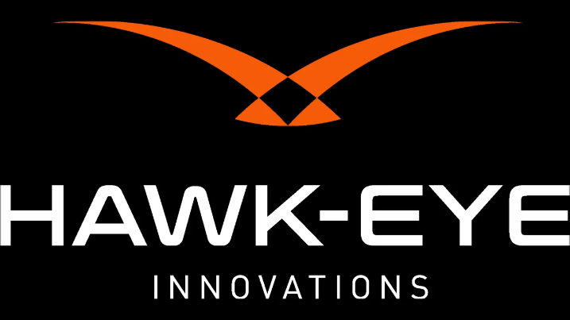
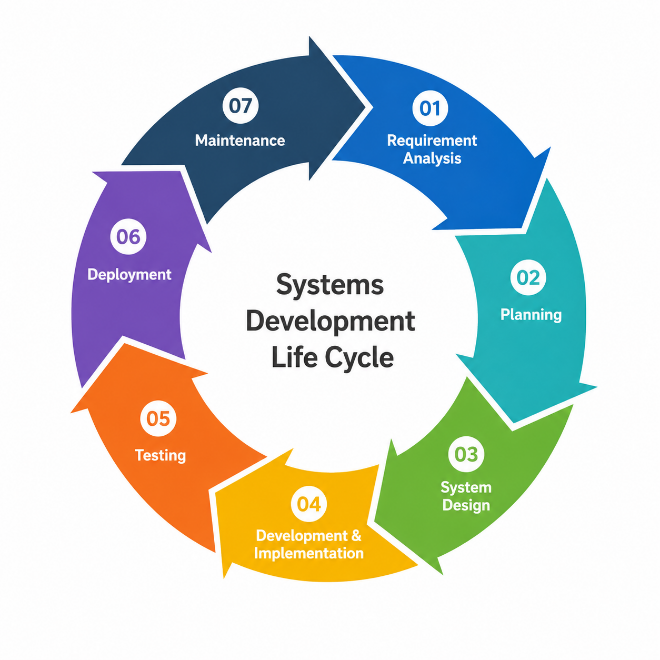
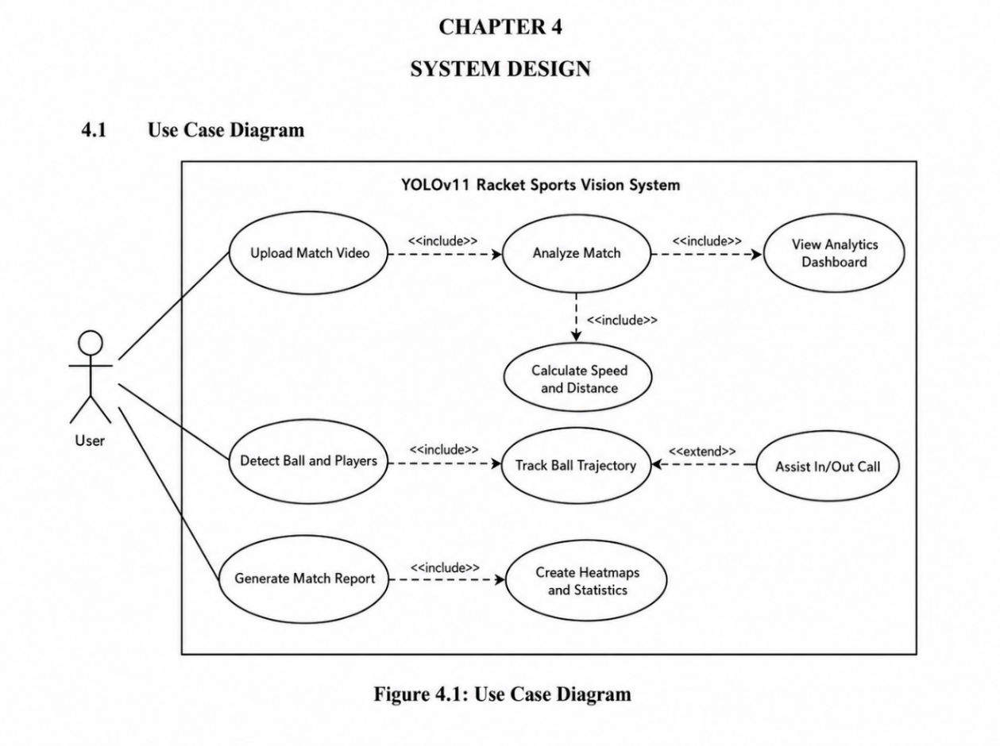
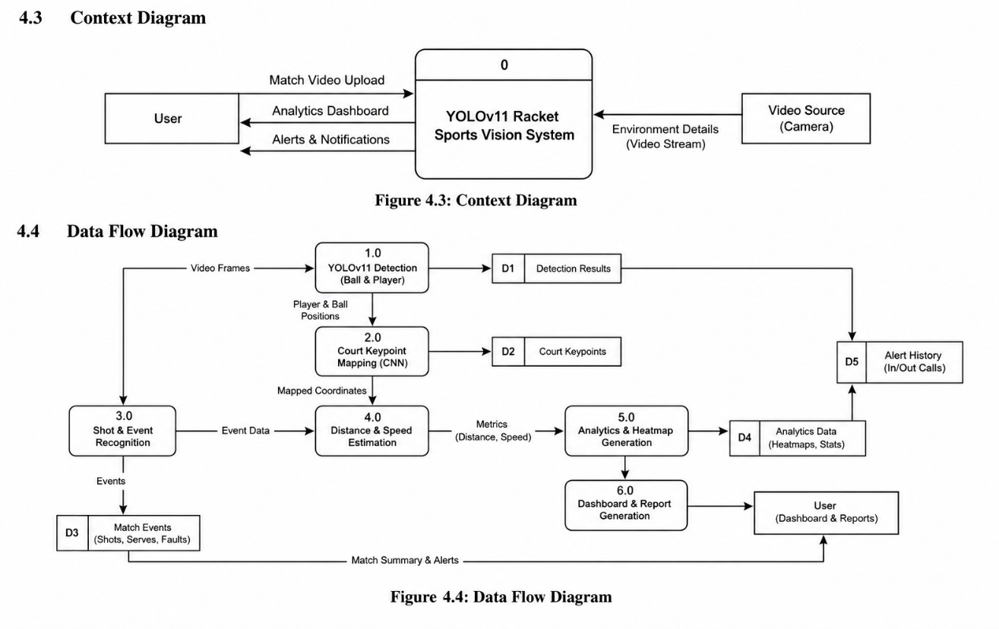
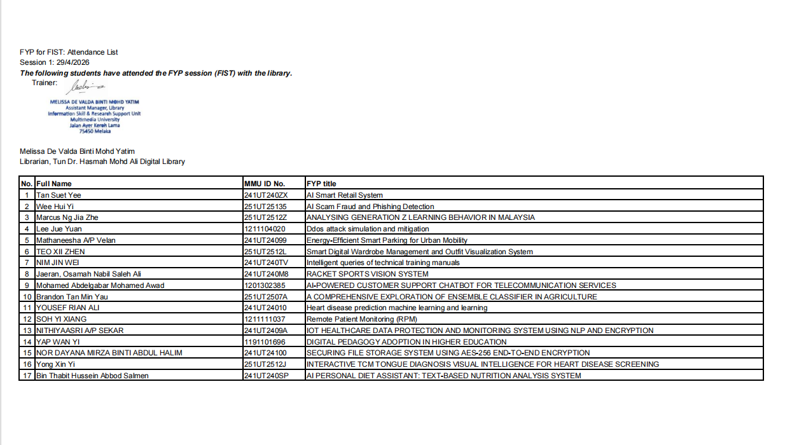

# T88J709 — Racket Sports Vision System

> Source conversion: `Jaeran_Osamah_Nabil_FYP1_final.docx` → GitHub-Flavored Markdown.
> The source wording and ordering are preserved as much as possible. Embedded document media are extracted under `report_assets/media/`.

---

1.  **RACKET SPORTS VISION SYSTEM**

###### 

**JAERAN, OSAMAH NABIL SALEH ALI**

FACULTY OF INFORMATION SCIENCE & TECHNOLOGY

MULTIMEDIA UNIVERSITY

JUNE 2026

2.  **RACKET SPORTS VISION SYSTEM**

##### 

BY

**JAERAN, OSAMAH NABIL SALEH ALI**

THE PROJECT REPORT IS PREPARED FOR

FACULTY OF INFORMATION SCIENCE & TECHNOLOGY

MULTIMEDIA UNIVERSITY

IN PARTIAL FULFILLMENT

FOR

BACHELOR OF COMPUTER SCIENCE (HONS)

ARTIFICIAL INTELLIGENCE

FACULTY OF INFORMATION SCIENCE & TECHNOLOGY

MULTIMEDIA UNIVERSITY

JUNE 2026

© 2026 Universiti Telekom Sdn. Bhd. ALL RIGHTS RESERVED

Copyright of this report belongs to Universiti Telekom Sdn. Bhd as qualified by Regulation 7.2 (c) of the Multimedia University Intellectual Property and Commercialization policy. No part of this publication may be reproduced, stored in or introduced into a retrieval system, or transmitted in any form or by any means (electronic, mechanical, photocopying, recording, or otherwise), or for any purpose, without the express written permission of Universiti Telekom Sdn. Bhd. Due acknowledgement shall always be made of the use of any material contained in, or derived from, this report.

###### DECLARATION

I hereby declare that the work have been done by myself and no portion of the work contained in this thesis has been submitted in support of any application for any other degree or qualification of this or any other university or institute of learning.

\_\_\_\_\_\_\_\_\_\_\_\_\_\_\_\_\_\_\_\_

JAERAN, OSAMAH

Faculty of Information Science & Technology

Multimedia University

Submission Date: 18: 06: 2026

Submission Time: 04: 30

###### ACKNOWLEDGEMENT

This project has not been completed by any single person. Firstly, I would like to thank my project supervisor, Prof. Dr. Goh Kah Ong Michae, very much for his great helpful guidance, constructive comments, and patience toward the end of my project.

I would also like to thank the staff and my university for providing the resources required for this project.

Regarding my own support, I thank my parents and my family for their support and encouragement all along. Finally, to my friends and classmates, I thank them for being cooperative with each other.

Jaeran, Osamah Nabil Saleh Ali

###### ABSTRACT

3.  Over time the advancements of AI and computer vision have significantly enhanced how sports performance can be analyzed by video. In tennis, an accurate reading of the ball, players movement and supported in/out calling would lead to fairer play and better coaching. Professional tennis analyzing systems such as Hawk-Eye tend to utilize complicated and costly multi-camera setups, thus being out of reach for most schools, clubs, amateur athletes and local training facilities. Instead, this project proposes a software based, AI powered tennis vision analyzing system called T88J709: RACKET SPORTS VISION SYSTEM**.**

This system is able to analyze post-recorded tennis matches without requiring specific court hardware. By using YOLOv11 for tennis ball and player detection, combined with a court keypoint mapping module to estimate tennis court boundary locations and map video coordinates to court based coordinates, this pipeline allows for ball trajectory tracking, player movement analysis, shot distribution measurement and assisted in/out calls. All of these outputs can be put together in an analysis dashboard to display insights such as the position of the ball at its bounce, a movement heatmap, a reading of ball speed and statistics related to the match.

The goal of this project is to create an inexpensive, accessible means of tennis match analysis. With the integration of object detection, tracking, court mapping and visualization, players, coaches, and officials are able to review and analyze tennis matches objectively. This system is intended to be a proof of concept and not a means to replicate a professional tournament officiating system but it does provide a glimpse into the capability of deep learning and computer vision applied to the domain of tennis match analysis utilizing only video input.

###### TABLE OF CONTENTS

[DECLARATIOn [III](#declaration)](#declaration)

[ACKNOWLEDGEMENT [IV](#acknowledgement)](#acknowledgement)

[Abstract [V](#abstract)](#abstract)

[Table of contents [VI](#table-of-contents)](#table-of-contents)

[List of tables [VIII](#list-of-tables)](#list-of-tables)

[List of figures [IX](#list-of-figures)](#list-of-figures)

[LIST OF ABBREVIATIONS/ SYMBOLS [X](#list-of-abbreviations-symbols)](#list-of-abbreviations-symbols)

[List of appendices [XI](#list-of-appendices)](#list-of-appendices)

[CHAPTER 1 [1](#chapter-1)](#chapter-1)

[1 INTRODUCTION [1](#introduction)](#introduction)

[1.1 Overview [1](#overview)](#overview)

[1.2 Problem Statement [2](#problem-statement)](#problem-statement)

[1.3 Project Objectives [2](#project-objectives)](#project-objectives)

[1.4 Project Scope [3](#project-scope)](#project-scope)

[CHAPTER 2 [5](#chapter-2)](#chapter-2)

[1 LITERATURE REVIEW [5](#literature-review)](#literature-review)

[2.1 Ball Tracking in Sports Videos [5](#ball-tracking-in-sports-videos)](#ball-tracking-in-sports-videos)

[CHAPTER 2 [5](#_Toc232634986)](#_Toc232634986)

[2.2 Court Detection and Field Registration [8](#court-detection-and-field-registration)](#court-detection-and-field-registration)

[2.3 Player Detection and Pose Estimation [10](#player-detection-and-pose-estimation)](#player-detection-and-pose-estimation)

[2.4 Systems and Frameworks for Sports Analytics [12](#systems-and-frameworks-for-sports-analytics)](#systems-and-frameworks-for-sports-analytics)

[2.5 Sports Video Analysis [16](#sports-video-analysis)](#sports-video-analysis)

[2.6 Deep Learning for Sports Event Detection [18](#deep-learning-for-sports-event-detection)](#deep-learning-for-sports-event-detection)

[2.7 Ball Trajectory Estimation [20](#ball-trajectory-estimation)](#ball-trajectory-estimation)

[2.8 Player Detection and Motion Analysis [21](#player-detection-and-motion-analysis)](#player-detection-and-motion-analysis)

[2.9 Artificial Intelligence in Tennis: A Bibliometric Review [23](#artificial-intelligence-in-tennis-a-bibliometric-review)](#artificial-intelligence-in-tennis-a-bibliometric-review)

[2.10 Existing Applications [24](#existing-applications)](#existing-applications)

[CHAPTER 3 [30](#chapter-3)](#chapter-3)

[2 METHODOLOGY [30](#methodology)](#methodology)

[CHAPTER 3 [30](#_Toc232635001)](#_Toc232635001)

[3.1 Software Development Life Cycle [30](#_Toc232635003)](#_Toc232635003)

[3.2 Tools [35](#tools)](#tools)

[3.3 Data Collection Strategy [39](#data-collection-strategy)](#data-collection-strategy)

[3.4 Milestone [41](#milestone)](#milestone)

[CHAPTER 4 [42](#chapter-4)](#chapter-4)

[3 SYSTEM DESIGN [42](#system-design)](#system-design)

[CHAPTER 4 [42](#_Toc232635009)](#_Toc232635009)

[4 [42](#_Toc232635009)](#_Toc232635009)

[4.1 Use Case Diagram [42](#_Toc232635012)](#_Toc232635012)

[4.2 Entity Relationship Diagram [43](#entity-relationship-diagram)](#entity-relationship-diagram)

[4.3 Context Diagram [44](#context-diagram)](#context-diagram)

[4.4 Data Flow Diagram [45](#data-flow-diagram)](#data-flow-diagram)

[4.5 Sequence Diagram [47](#sequence-diagram)](#sequence-diagram)

[4.6 System Flowchart [48](#system-flowchart)](#system-flowchart)

[4.7 User Interface Design and Prototype [50](#user-interface-design-and-prototype)](#user-interface-design-and-prototype)

[CHAPTER 5 CONCLUSION [55](#conclusion)](#conclusion)

[REFERENCES](#section-3) [57](#section-3)

[APPENDICES [57](#references)](#references)

###### LIST OF TABLES

Table 2.1: Summary of Ball Tracking in Sports Videos 17

Table 2.2: Court Detection and Field Registration 19

Table 2.3: Player Detection and Pose Estimation 20

Table 2.4: Systems and Frameworks for Sports Analytics 23

Table 2.5: Sports Video Analysis 25

Table 2.6: Deep Learning for Sports Event Detection 27

Table 2.7: Ball Trajectory Estimation 28

Table 2.8: Player Detection and Motion Analysis 29

Table 2.9: Artificial Intelligence in Tennis: Bibliometric Review 30

Table 2.10: Comparison of Existing Tennis Analysis Applications 33

Table 3.1: Hardware Tools 41

Table 3.2: Software Tools 44

Table 4.1: Analytics Dashboard Panel Summary 56

###### LIST OF FIGURES

Figure 2.1: Swing Vision 31

Figure 2.2: Hawk-Eye system 32

Figure 2.3: Playsight 32

Figure 2.4: Qlipp 32

Figure 3.1: SDLC Agile Model 36

Figure 3.2: Gantt Chart 46

Figure 4.1: Use Case Diagram 48

Figure 4.2: Entity Relationship Diagram 49

Figure 4.3: Context Diagram 49

Figure 4.4: Data Flow Diagram 51

Figure 4.5: Sequence Diagram 52

Figure 4.6: System Flowchart 53

Figure 4.7: Analytics Dashboard - High-Fidelity Prototype 53

Figure 4.8: Analysis Page 55

Figure 4.9: Heatmap Page 55

######  LIST OF ABBREVIATIONS/ SYMBOLS

**AI** Artificial Intelligence

**API** Application Programming Interface

**CNN** Convolutional Neural Network

**CV** Computer Vision

**FN** False Negative

**FP** False Positive

**FPS** Frames Per Second

**GPU** Graphics Processing Unit

**HSV** Hue, Saturation, Value

**IDE** Integrated Development Environment

**ML** Machine Learning

**OCR** Optical Character Recognition

**SDLC** Software Development Life Cycle

**TN** True Negative

**TP** True Positive

**TPR** True Positive Rate

**UI** User Interface

**YOLO** You Only Look Once

###### LIST OF APPENDICES 

[**Appendix A: Meeting Logs** [65](#_Toc232687600)](#_Toc232687600)

[**Appendix B: LLC Course** [71](#_Toc232687601)](#_Toc232687601)

[**Appendix C: Checklist for FYP Interim Submission** [72](#_Toc232687602)](#_Toc232687602)

# CHAPTER 1

##  INTRODUCTION

### Overview

The following project proposes the creation of an intelligent computer vision system titled T88J709: Racket Sports Vision System. The system is specially built to automatically analyze tennis games and act as a decision support for these games. The project requires an objective and robust, software driven approach, which will enable computer vision and deep learning to generate rich match statistics from standard match videos. Unlike high-end systems that need significant on-court hardware and multiple synchronized camera systems, the proposed system is designed as a standalone, video based, product which would make these sports technology applications much more affordable and accessible to local clubs, schools, and individual players. The system combines both detection and tracking models to predict players, balls and the court boundaries. The system produces objective 'In/Out' decisions that can help support human decisions, from an input of standard match videos (such as MP4 or AVI files) which can facilitate decisions. Beyond the objective decision support, the project's unique ability lies in its Athletic Analytics Dashboard where performance statistics such as ball and player speeds and distance covered can be viewed. Moreover, it generates heatmap distributions over the court, enabling coaches and athletes to critically evaluate performance and identify tactical shortcomings, based on facts. In order to maintain an accurate high-speed performance, the project utilized a modified YOLO (Redmon et al., 2016) to predict the objects of interest, whereas for court key-point prediction, a specific CNN model is proposed. PyTorch can be used throughout the system's life cycle to build up a simple yet powerful computer vision application that analyses the video and provides coaches with crucial statistical data without any high cost dedicated court infrastructure and professional coaching aid using just a single standard video (Agrawal et al., 2024; Jouini et al., 2024).

### Problem Statement

There are a few real-world issues in sports officiating and coaching that necessitated the creation of this computer vision-based system:

- Human error in tennis officiating is prevalent at non-professional levels. As the speed of tennis balls is incredibly high, and the players may be exhausted, the accuracy of the human eye may not be perfect, or bias may interfere, with human decisions causing unfair games and matches (Sampaio et al., 2024; Mendes-Neves et al., 2023).

- Prohibitively high costs of high-tech solutions in tennis: The leading technology in tracking balls is Hawks-Eye, however it is incredibly expensive and requires a sophisticated camera and installation setup. This level of technology is not financially viable for the majority of the tennis playing public that comprises of amateur clubs and training centers (Wong, 2016).

- **Lacking insightful performance data for athletes:** While many players record and watch their matches, they have no effective way to generate any performance data. Currently, it is laborious and highly inaccurate to gather data on a players workload and their accuracy of shots on the court.

- **Motion blur and accuracy challenge with high-velocity objects:** Tennis balls are small and have very high velocities, making their motion challenging to predict accurately in standard videos. There is an obvious demand for an AI system that could accurately predict the objects regardless of motion blur, or without the requirement for multiple, specialized high-speed cameras.

- **Hardware and processing burden on users:** Almost all present day sports analysis applications need multiple cameras or some wearable devices on the players to achieve the desired outcome. This project creates a Zero resource, user friendly system that analyzes sport games with a single high resolution video input.

### Project Objectives

To mitigate human error in officiating and make match data easily accessible, the project is designed with the following objectives:

- To design and build an AI system using fine-tuned deep learning models (e.g. YOLO (Redmon et al., 2016)) that detects and tracks the ball and players at high speeds in video.

- To design and implement a court mapping and keypoint estimation module using CNNs that estimates accurate court boundaries and ball-line intersections (Agrawal et al., 2024; Jouini et al., 2024).

- **To design and build an assistant automated scoring system** that uses ball-line intersection predictions for accurate and objective "in/out" calls and near-real time score tracking.

- **To include athlete performance analysis features** that automatically calculates metrics like distance covered, average speed and shot distribution heatmaps.

- **To create a proof-of-concept system**, a Data Analytics Dashboard, that processes video and provides actionable analytics to improve player tactics.

### Project Scope

The project takes a software-centric approach to sport analysis and is limited to the following boundaries:

- **Video Input:** The system is designed to work exclusively with recorded video files (e.g. MP4 or AVI format) that are captured from a single, static baseline perspective. The system is defined as "software-centric video-based", and therefore does not involve specialized on-court sensor or camera array infrastructure.

- **Decision Support Tool:** The system generates objective "in/out" calls that assist players and officials; however, the precision is targeting a tool rather than a replacement for existing, professional tournament-level hardware.

- **Tennis Only:** The scope is restricted to the sport of tennis, and the scoring logic has been programmed to comply with standard tennis rules and court dimensions.

- **Performance Data:** The application tracks the following player performance statistics:

<!-- -->

- **Player Movement** - Total distance covered, burst speed etc.

- **Tactical Heatmaps** - Ball bouncing locations, player positioning.

- **Shot analysis** - shot classification, ball velocity etc.

<!-- -->

- Technical Approach: The development will be based on the Python programming language and implemented using the PyTorch framework and YOLO (Redmon et al., 2016) model to achieve near-real time speeds without specialized hardware.

#  CHAPTER 2

## **LITERATURE REVIEW**

### Ball Tracking in Sports Videos

1.  

    1.  
    2.  1.  

#### Deep Learning-Based Ball Tracking

Object detection of fast-moving, small objects on a series of frames is the main challenge of sport video analysis. Since the advent of deep learning techniques in the field, numerous studies have been proposed recently to handle the detection of ball in various racket sports such as tennis, badminton, table tennis.Text typed 1.5 spaced, double-spaced between entries/paragraphs. Spacing between last line of text and the next subsection title is 4.5 lines.

Huang et al. (2019) introduced TrackNet. TrackNet is a deep learning network designed for tracking tiny and fast-moving objects in sports applications such as tennis. It consists of the first 13 layers of VGG-16 for feature extraction and a DeconvNet-style decoder for pixel-wise prediction. Then, an output heatmap is produced, which describes the probability of the balls’ presence in each pixel location. Instead of predicting the ball from a single frame, the network takes a couple of frames to determine the movement pattern of the balls so that motion blur and ghost are handled. Their experimental results show that on the 2017 Summer Universiade men’s singles final video from YouTube the precision was 99.7%, recall 97.3% and F1-measure 98.5%. Strengths of this study is the heatmap based formulation allowing to generalize on different visual conditions but a limitation of this work is that it is tested on only one broadcast match video. Lower quality amateur footage might decrease the accuracy of the performance.

Chen and Wang (2023) proposed TrackNet V3 which is a more complex system that aims to track shuttlecocks in broadcast badminton videos by combining two components: trajectory prediction and trajectory rectification. When the shuttlecock is occluded, the system predicts the trajectory and interpolates its path for each missed frame. Furthermore, the MixUp data augmentation is used, and the background image estimation is utilized to train a robust prediction network to reduce visual interferences. The achieved tracking accuracy was 97.51%, higher than 94.98% for TrackNet V2 and 53.47% for YOLO v7. The effectiveness of the proposed combination of prediction and post-hoc rectification is proved. A drawback of this approach is its specialization to the single-view, broadcast quality badminton videos, limiting its generalizability to other sports and amateur footage.

Gossard et al. (2026) introduced a new model called BlurBall for joint ball detection and motion blur estimation for table tennis. The proposed model follows the convention of labeling the ball by the center of blur instead of the front edge of the blur streak so that the ground truth is more consistent. Multi-frame inputs along with Squeeze-and-Excitation attention mechanism are used for training the network and extracting temporal features. A new, labeled data set of table tennis shots is released by the authors to train their BlurBall model, along with motion blur annotation. This new strategy is state-of-the-art for detection task and demonstrates significant improvement in terms of stability and prediction error (median trajectory error of 19.9 px vs 28.4 px in the position-only baseline), when blur estimation is jointly optimized. Limitations of this work include the fact that the blur estimation component requires computational resources, and may fail at times when the blur length is short.

Xu et al. (2026) proposed TOTNet (Temporal Occlusion Tracking Network) which deals with one of the most challenging problems of ball tracking: long and complete occlusion. While previous methods usually were developed and evaluated on broadcast quality, multi-camera sport footage, TOTNet targets single-view fixed-angle captures that are typical for Paralympic sports, semi-professional and amateur contexts. Along with their model, they release the first professional annotated Paralympic table tennis benchmark, TTA (Table Tennis Australia) dataset, containing 2,396 occluded cases including 998 full occlusion instances and also dense visibility labels. Their model outperforms existing tracking methods by reducing RMSE to 63.41, from 105.73 in tennis. The performance in full occlusion situations depends on the quality of the temporal context.

Table 2.1: Summary of Ball Tracking in Sports Videos

| **Author**            | **Key Findings**                                                                                                                                    | **Results**                                                                                      | **Limitations**                                                                               |
|-----------------------|-----------------------------------------------------------------------------------------------------------------------------------------------------|--------------------------------------------------------------------------------------------------|-----------------------------------------------------------------------------------------------|
| Huang et al. (2019)   | Develop TrackNet using VGG-16 + DeconvNet architecture with heatmap-based detection for tennis ball tracking from consecutive frames                | Precision: 99.7% Recall: 97.3% F1-measure: 98.5%                                                 | Dataset limited to a single broadcast match; may not generalise to amateur footage            |
| Chen & Wang (2023)    | Introduce TrackNetV3 with trajectory prediction and rectification modules for shuttlecock tracking in badminton                                     | Accuracy: 97.51% (vs. TrackNetV2: 94.98%; YOLOv7: 53.47%)                                        | Limited to broadcast badminton; may not generalise to other sports or amateur recordings      |
| Gossard et al. (2025) | Propose BlurBall with centre-of-blur labelling strategy and SE attention over multi-frame input for table tennis ball detection and blur estimation | Trajectory RMSE reduced from 28.4 px to 19.9 px; state-of-the-art detection performance          | Blur estimation adds overhead; short blur streaks remain challenging                          |
| Xu et al. (2026)      | Propose TOTNet and TTA dataset for occlusion-robust ball tracking in Paralympic table tennis under single-view conditions                           | RMSE for partial occlusion: 105.73 → 63.41 on tennis dataset; state-of-the-art across 4 datasets | Performance degrades under very long occlusion gaps; dependent on quality of temporal context |

### Court Detection and Field Registration

#### Sports Court Line and Field Registration Methods

Accurate detection and registration of the sports court is a prerequisite for a variety of downstream tasks in sports analysis, such as ball bounce localization, player positioning, and automated line-call detection. There exist a variety of approaches combining classical image processing techniques with modern deep learning models that overcome challenges such as occlusion, shadows, variable camera angle, and heterogeneous court surfaces.

Jouini et al. (2024) presented a deep learning-based approach for the registration of sports courts for racket games, from broadcast video data. The approach comprises both semantic segmentation and homography estimation stages, utilizing an encoder-decoder neural network (with ResNet-50 as encoder and DeepLabV3Plus as decoder) trained to predict the pixel-level segmentation mask of the sports court, which is then used to compute the homography between the camera perspective and a reference court model. To evaluate the proposed framework, two custom datasets of tennis and badminton are generated and compared with a traditional hand-crafted baseline approach, where the best-performing variant achieved 99.01% test mIoU on the badminton dataset. The proposed deep learning-based framework is able to outperform the classical hand-crafted baseline in terms of both accuracy and inference time. The authors suggest the model's dependency on the court colour and appearance as a limiting factor, possibly requiring further retraining on datasets of novel court types.

Agrawal et al. (2024) proposed a series of modifications to the standard Hough-line-detection-based algorithm for the detection of tennis court lines from videos recorded by amateur players. Four contributions were highlighted, including a shadow removal pipeline utilizing both MTMT (for shadow detection) and ShadowFormer (for shadow removal), a detection module employing a YOLO-v5 network (Redmon et al., 2016) for the detection of the net and crops to the near-side of the court, a filtering mechanism operating on the detected color of the court instead of a brightness threshold, and a method for determining the best possible court detected from a series of detections. With this combination, the proposed algorithm is much more robust to dirty and shadowed tennis court lines at low angles than the original algorithm. The main disadvantage is that performance may be affected if either the shadow removal or net detection fail.

Table 2.2: Court Detection and Field Registration

| **Author**            | **Key Findings**                                                                                                                                               | **Results**                                                                           | **Limitations**                                                                      |
|-----------------------|----------------------------------------------------------------------------------------------------------------------------------------------------------------|---------------------------------------------------------------------------------------|--------------------------------------------------------------------------------------|
| Jouini et al.         | Propose deep learning framework combining semantic segmentation (ResNet-50 + DeepLabV3Plus) and homography estimation for racket sports court registration     | Test mIoU: 99.01% (badminton); outperforms handcrafted baseline in accuracy and speed | Generalisation to unseen court types may require additional training data            |
| Agrawal et al. (2024) | Improve Hough-line court detection with shadow removal (ShadowFormer), YOLO-v5 net detection, color-based filtering, and scoring algorithm for amateur matches | Improved robustness on dirty, shadowed, and low-angle courts vs. original baseline    | Performance depends on accuracy of upstream shadow-removal and net-detection modules |

### Player Detection and Pose Estimation

#### Player Detection and Motion Analysis in Tennis

Accurate player detection and pose estimation serve as fundamental building blocks of modern sports analytics systems.These components provide useful representations of on-field game states for downstream tasks such as shot classification,tactical formation analysis and player performance modeling.

Sharma et al. (2025) introduced Tennis Vision,an automated sports analytics system for the analysis of tennis matches.The system includes object detection for players and the ball based on YOLO, court keypoint estimation for perspective correction, and player pose estimation based on OpenPose-based models (Cao et al., 2021) for limb and joint tracking.The YOLO-based detection system was trained through transfer learning and reached a mean Average Precision (mAP) of 92.3%. It also offers a mini-map view for shot distribution and player statistics about shot velocity and velocity of motion. A limitation to the current system is the dependency of the ball tracking system on continuous visibility, so cases of occluded and disappearing ball will require specific treatment.

Mendes-Neves et al. (2023) provide a review of various modern computer vision methods applicable in sports analytics. The paper also covers object detection and pose estimation, and demonstrates their use in building data driven models, such as estimating shot speed with 67% correlation to the ground truth measurements, using only the computer vision approach, without sensors. This implies computer vision is a viable replacement for traditional sensors in large-scale sports data collection. They mention however, measurement errors, which must be taken into account when using pose estimation, and the limitation due to availability of video material, and to the accuracy differences in 2D versus 3D pose estimation.

Table 2.3: Player Detection and Pose Estimation

| **Author**                 | **Key Findings**                                                                                                                         | **Results**                                                                          | **Limitations**                                                                          |
|----------------------------|------------------------------------------------------------------------------------------------------------------------------------------|--------------------------------------------------------------------------------------|------------------------------------------------------------------------------------------|
| Sharma et al. (2025)       | Integrate YOLO detection, court keypoint extraction, and pose estimation for tennis match analytics with shot and movement visualisation | mAP: 92.3% for player/ball detection; accurate court keypoint localisation           | Ball tracking may fail during occlusion or when ball exits the frame                     |
| Mendes-Neves et al. (2023) | Survey of CV techniques for sports; demonstrate shot speed estimation from pose data using computer vision                               | Shot speed estimation: 67% correlation with ground truth using pose-only CV pipeline | Measurement error inherent in pose estimation models; limited by video data availability |

### Systems and Frameworks for Sports Analytics

#### Infrastructure for Real-Time Sports Vision Applications

Besides performant ML models, efficient software infrastructure that enables processing of nearly near-real-time data streams, multi-model pipelines, and deployment across different platforms is necessary in practice. Two of the most prevalent frameworks for sports vision research are MediaPipe and PyTorch.

The framework of Lugaresi et al. (2019) is called MediaPipe. It is an open-source framework by Google Research used for creating perception pipelines based on a directed graph structure made up of modular components, known as calculators. Each calculator performs a certain operation on a data packet, which is then passed along a specified time-series stream to other nodes on the graph. This framework offers built-in support for accelerating computation on mobile platforms (iOS and Android) by using the GPU with OpenGL ES. The tools provide include a profiler, tracer for evaluating the execution time and memory usage of each calculator, and a visualizer for understanding the graph's topology. MediaPipe was implemented to provide near-near-real-time object detection, face landmark detection in the original research paper. However, a significant weakness is its dependency on its own graphing language, a tool that may take time for developers to learn.

Paszke et al. (2019) implemented PyTorch, an imperative and Python-based deep learning framework that is one of the leading frameworks for building sports vision models. The software is designed for debugging through a dynamic computation graph using the eager execution mode, providing flexible model architectures and making it simple for developers. Among the many performance boosting aspects, it includes a C++ backed(libtorch), an optimized CUDA memory allocator for the avoidance of synchronization issues in memory, asynchronous GPU executions and, a parallel multiprocessing library for data loading. PyTorch offers automatic differentiation with its autograd mechanism for easily calculating gradients for new operations. Although highly flexible and commonly used, the lack of a default static computational graph requires a more challenging process of deployment and hardware-specific optimization than frameworks like TensorFlow.

Fazio et al. (2018) proposed a low-cost 3D tennis ball trajectory estimation system by using stereo vision on consumer smart phones. The proposed system combines image segmentation, HSV color masking, Hough transform based court corner detection, camera calibration, multi-view geometry and Kalman filter state estimation techniques to accurately estimate the 3D trajectory of a tennis ball. The output is frame-by-frame position and velocity estimation of the ball with 0.5m as the average position error. The framework shows the viability of an affordable 3D vision approach to ball trajectory analysis, without specialized equipment. The major weaknesses include the system's sensitivity to light conditions, camera calibration error, player motion and, relatively large position estimation error compared to professional systems.

The design and evaluation of a low cost tennis line call and ball speed estimation system was discussed in a different research work (Wong, 2016). Based on the problem introduced by the Hawk-Eye system, this approach used 4 Logitech C615 web cameras(800600, 30 fps) on tripods mounted on the court posts with a total cost of hardware equipment at around \$224 USD. The balls are detected by the frame differencing method with background subtraction. The trajectory is estimated using geometric projection. The system demonstrated good results and 8 mm spatial precision on T-point was achieved, which proves the effectiveness of cheap 3D tennis ball trajectory analysis systems for sports. However, it was stated that some of the detection methods are not as robust to faster balls and players in the scene as some expensive systems.

Table 2.4: Systems and Frameworks for Sports Analytics

| **Author**             | **Key Findings**                                                                                                                                            | **Results**                                                                                             | **Limitations**                                                                                  |
|------------------------|-------------------------------------------------------------------------------------------------------------------------------------------------------------|---------------------------------------------------------------------------------------------------------|--------------------------------------------------------------------------------------------------|
| Lugaresi et al. (2019) | Propose MediaPipe, a graph-based perception pipeline framework supporting cross-platform ML deployment with GPU acceleration and developer tooling          | Demonstrated real-time object detection and face landmark estimation; successful at Google for 6+ years | Steep learning curve due to graph-configuration paradigm and custom calculator API               |
| Paszke et al. (2019)   | Present PyTorch, an imperative deep learning library with dynamic computation graph, C++ backend, custom CUDA allocator, and autograd engine                | Widely adopted; flexible for research; efficient GPU execution via asynchronous CUDA streaming          | Dynamic graph complicates production deployment and hardware-specific optimisation               |
| Fazio et al. (2018)    | Develop stereo smartphone-based 3D tennis ball trajectory estimation using Hough transform, multi-view geometry, and Kalman filter; cost-effective approach | Average 3D position error: ~0.5 m; real-time ball position and speed estimation                         | Sensitive to lighting; reliant on precise camera placement; large error vs. professional systems |
| Wong, Y.-P. (2016)     | Implement low-cost tennis line-call and ball speed detector using 4 webcams (\$224 total) with background subtraction and geometric projection              | Spatial precision: 8 mm at T-point; demonstrates feasibility of affordable line-call system             | Less robust for fast balls; detection degrades when players are in the scene                     |

### Sports Video Analysis

#### Tennis Video Indexing and Event Detection

Sports video analysis can greatly benefit from automatic sports video indexing and event detection which have gained a significant momentum of late. Tennis broadcasts, however, have presented unique challenges due to their often varying camera angles, fast-paced nature of the game and specific scoring structure. In what follows, there are several systems proposed for tennis video indexing and event detection.

Ghosh and Jawahar (2018) proposed SmartTennisTV, an indexer of tennis broadcasts based on score recognition. Rally segments are first detected in broadcast video, then their respective scores are extracted. Domain-specific scoring rules for tennis are employed for corrections of the estimated scores. An interactive interface of TennisTV enables navigation to specific points, games and sets, and it also indexes identified segments by events such as "fault" or "deuce". Tested on a collection of tennis matches broadcast by major tournament coverage, this system yielded F1 scores of 97.46% and 98.94% for rally/non-rally segment detection respectively. The score predictor had also demonstrated impressive accuracy, particularly after integrating domain knowledge for score estimation. The system is particularly interesting because it integrates domain-specific rules for improved indexing accuracy and thus shows promising performance for broadcast videos in real-world settings. One potential weakness is the variability of scoreboard positions and formats across broadcasts and dependence of the system's performance on the underlying OCR and text detection modules.

Polk et al. (2014) presented TenniVis, a tool that visualizes tennis matches with minimal input from an observer trained on a standard single camera broadcast feed. This included on-screen score detection, point time within the match and winning point information (win/loss). The system used 2 unique visualizations to provide a summary of match statistics (Pie Meter View and a bar chart of win/loss points), with interactive mechanisms for hypothesis testing and verification. Performance of the system was demonstrated for the 2007 Australian Open final by comparing system analysis with actual match records and by questioning two professional tennis coaches about the tool's accuracy. A major advantage of this system is its ability to process the required information from a single camera, whereas other systems generally require a multi-camera setup to obtain ball trajectory and positional data. A potential drawback of TenniVis is that it does not employ player tracking.

Table 2.5: Sports Video Analysis

<table>
<colgroup>
<col style="width: 16%" />
<col style="width: 28%" />
<col style="width: 23%" />
<col style="width: 32%" />
</colgroup>
<tbody>
<tr class="odd">
<td>Author</td>
<td>Key Findings</td>
<td>Results</td>
<td>Limitations</td>
</tr>
<tr class="even">
<td>
Ghosh &amp;

Jawahar
</td>
<td>
SmartTennisTV

Rally segmentation

Score recognition + refinement

Auto event tagging (fault, deuce)
</td>
<td>
Rally F1: 97.46%

Non-rally precision: 98.94%

Rally precision: 95.41%
</td>
<td>
Scoreboard format varies

Accuracy tied to OCR quality
</td>
</tr>
<tr class="odd">
<td>
Polk et al.

(2014)
</td>
<td>
TenniVis system

Single-camera only

Pie Meter + bar chart views

Linked video playback
</td>
<td>
Validated on 2007 AO final

2 coach user studies passed
</td>
<td>
No ball/player tracking

Spatial analysis limited
</td>
</tr>
</tbody>
</table>

### Deep Learning for Sports Event Detection

#### Temporal Event Spotting and Action Localization

Deep learning currently dominates Sports Video Event Detection. A very useful survey by Xu et al. (2025) details various methods for Deep Learning for Sports Video Event Detection tasks including event types, datasets, algorithms, and challenges. Within the article they define three distinct but related tasks of TAL (Temporal Action Localization) where "full-duration actions should be detected", AS (Action Spotting) "where a representative timestamp should be identified" and PES (Precise Event Spotting) where "the exact frame of an event is located". They describe the state-of-the-art through three aspects: "Temporal modeling approaches", "Multimodal systems", and "Data-efficient methods" and also highlight the limitations of the datasets and evaluation metrics including "over-reliance on broadcast-quality video and evaluation metrics that heavily reward permissive multi-label predictions". The survey's strong points are the wide breadth of data, clear distinction of task types, and providing the knowledge necessary to develop a generic, working sports video understanding system, a main issue in existing sports video surveys is the focus solely on the professional sport world and a lack of real-world data.

Liu et al. (2026) produced an analytical, large-scale framework for expert level tennis videos titled "TennisExpert". As a compliment to the TennisExpert framework, they generated a large-scale tennis video dataset, "TennisVL", comprising over 200 matches totaling 471.9 hours, as well as over 40,000 rally-level clips that consist of expert tennis video commentary focusing on tactical play, player decisions, and game momentum. TennisExpert couples a video semantic parser with a memory-augmented LLM based on Qwen3-VL-8B. The parser works by extracting key factors such as game scores, player sequences, bounces and player positions from the video feed, while a tiered memory system incorporates and extracts information over both short and long-term temporal aspects of the match. The authors reported significant improvements in both CIDEr scores of 43.71 (over five times the score of the next zero-shot model) and LLM expert scores of 88.05 over all current proprietary baselines, including those from GPT-5, Gemini, and Claude. The framework itself runs at up to 40FPS in a real-time system, utilizing roughly 20GB of VRAM and with a lag under 2 seconds per rally. A limitation, noted by the authors is the large computational requirement in terms of hardware (4 NVIDIA H200) to perform training of the model itself, along with the domainspecific aspect of the work.

Table 2.6: Deep Learning for Sports Event Detection

<table>
<colgroup>
<col style="width: 16%" />
<col style="width: 28%" />
<col style="width: 23%" />
<col style="width: 32%" />
</colgroup>
<thead>
<tr class="header">
<th><strong>Author</strong></th>
<th><strong>Key Findings</strong></th>
<th><strong>Results</strong></th>
<th><strong>Limitations</strong></th>
</tr>
</thead>
<tbody>
<tr class="odd">
<td>
Xu et al.

(2025)
</td>
<td>
Survey: TAL, AS, PES tasks

Taxonomy of DL methods

Benchmark &amp; dataset review

Covers pooling, encoder, frame-aware models
</td>
<td>
Context-aware loss: +12.8% mAP

Frame-aware models: SOTA on PES

28-page comprehensive survey
</td>
<td>
Benchmarks use broadcast footage only

Metrics favor multi-label predictions

Ignores non-elite practitioners
</td>
</tr>
<tr class="even">
<td>
Liu et al.

(2026)
</td>
<td>
TennisExpert framework

TennisVL benchmark (200+ matches)

Video parser + Qwen3-VL-8B

Short &amp; long-term memory modules
</td>
<td>
CIDEr: 43.71 (5× best baseline)

LLM Expert Score: 88.05/100

Parser: up to 40 FPS

Latency: &lt;2s | VRAM: ~20 GB
</td>
<td>
Tennis-specific only

Requires 4× H200 GPUs for training

High fine-tuning cost
</td>
</tr>
</tbody>
</table>

### Ball Trajectory Estimation

#### 3D Ball Tracking from Monocular Video

Ponglertnapakorn and Suwajanakorn (2025) describes a method for 3D ball trajectory estimation from a 2D monocular tracking sequence. To deal with 3D ambiguities in 2D projections, they created an LSTM-based pipeline, which used an invented canonical 3D representation that was insensitive to camera location, thereby allowing generalization to arbitrary viewing positions and multiple concatenated trajectories that include bouncing and hitting. The model has several intermediate representations that are guided to maintain reprojection consistency and relevant invariances. The method was tested on four synthetic and three real data sets and generalized beyond simulation-to-real data sets without training on any real-world data but on synthetic data rendered using the Unity game engine with PhysX and achieved superior results compared to previous methods by up to 75.4% for NRMSE on real data and showed generalization to the task with real data with several consecutive trajectories. Applications arepost-game analysis and virtual replay. Strengths of the work is the generalization to real-world data with previously unseen viewing angles with multiple subsequent trajectories, and it does not require any camera calibration. Limitations are lack of ball spin and air aerodynamic modelling, which is important when accuracy on different pitch types, like grass surfaces.

Table 2.7: Ball Trajectory Estimation

<table>
<colgroup>
<col style="width: 20%" />
<col style="width: 27%" />
<col style="width: 21%" />
<col style="width: 30%" />
</colgroup>
<thead>
<tr class="header">
<th><strong>Author</strong></th>
<th><strong>Key Findings</strong></th>
<th><strong>Results</strong></th>
<th><strong>Limitations</strong></th>
</tr>
</thead>
<tbody>
<tr class="odd">
<td>
Ponglertnapakorn &amp;

Suwajanakorn (2025)
</td>
<td>
LSTM-based 3D trajectory estimation

Camera-independent representation

Trained on Unity/PhysX simulation

Handles multi-bounce trajectories
</td>
<td>
SOTA on 4 synthetic + 3 real datasets

NRMSE improved up to 75.4%

Generalizes sim → real world
</td>
<td>
No ball spin modeling

No aerodynamics / court type

Relies on 2D tracking quality
</td>
</tr>
</tbody>
</table>

### Player Detection and Motion Analysis

#### Human Pose Estimation in Racket Sports

Brumann et al. (2021) produced a systematic comparison of free, readily available Human Pose Estimation CNNs which can be used for player tracking and motion analysis in squash. This review evaluated over 250 Human Pose Estimation CNNs (HPE-CNNs), according to criteria of being open source, pre-trained, state-of-the-art, and usable for out-of-the-box inference. Five models from three types of HPE-CNNs were selected and examined according to their accuracy in tracking the player feet locations from a single static camera view. A custom annotation tool was used to label a new data set of a manually annotated court floor and player tracking, from free access squash match video's, with a ground truth data set of over 180,160 frames drawn from several videos, one frame chosen every second in each video to annotate. The results section gives a map showing the court floor occupancy from the point of view of the camera and a birds eye view, in order to show areas where the player is strong and weak. A decision flow chart is also presented for sports scientists, coaches and players to help decide on the most appropriate HPE-CNN for the application in hand. The paper's strengths were a very systematic review methodology and a good decision tool for practical use in the area. The weakest points of this work is the fact it considered only a single, stationary, static camera view and had a very high annotation effort, of estimated 200 hours for fully manually labeling each frame, although there was one image selected for every second in this work (Agrawal et al., 2024; Jouini et al., 2024).

Table 2.8: Player Detection and Motion Analysis

<table>
<colgroup>
<col style="width: 16%" />
<col style="width: 28%" />
<col style="width: 23%" />
<col style="width: 32%" />
</colgroup>
<thead>
<tr class="header">
<th><strong>Author</strong></th>
<th><strong>Key Findings</strong></th>
<th><strong>Results</strong></th>
<th><strong>Limitations</strong></th>
</tr>
</thead>
<tbody>
<tr class="odd">
<td>
Brumann et al.

(2021)
</td>
<td>
250+ HPE-CNNs evaluated

Squash foot detection

Single stationary camera

Court heatmaps generated

Decision flowchart provided
</td>
<td>
5 variants of 3 CNNs selected

Dataset: 180,160 frames

Metrics: Precision, Recall, F1, AP

1 px = 1 cm top-down heatmap
</td>
<td>
Single fixed camera only

Annotation cost ~200 hours

Feet only – no full body pose
</td>
</tr>
</tbody>
</table>

### Artificial Intelligence in Tennis: A Bibliometric Review

Sampaio et al. (2024) provided a scoping and bibliometric review of research employing artificial intelligence within tennis and examined issues relating to performance, health, matches outcomes, physiological data, tennis spending and prize money. All relevant articles were compiled until 2024 through Web of Science database, where 389 records were initially selected then filtered and 108 articles were eventually analyzed. The data showed an irregular break between the number of articles published, during the period 2007-2008 and 2012-2013. The study then showed a sharp increase in the production of articles starting from 2012 reaching a peak in 2022, where the USA, China and Australia presented more papers on AI in tennis, while the analysis showed three main clusters namely; Performance Analysis and Optimization, Technological Integration and Innovation, and Biomechanics and Wearable Technology. The bibliometric analysis explained how the usage of AI in tennis evolved and listed countries and authors who had contributed considerably in this field, and a model predicted a gradual increase in the number of articles and citations until 2034. This is a strong review as it was built on solid bibliometric methodology, it shows the trend for the research in the coming decade, a weak point is that it only relied on the Web of Science and missed relevant papers from other sources.

Table 2.9: Artificial Intelligence in Tennis: Bibliometric Review

<table>
<colgroup>
<col style="width: 16%" />
<col style="width: 28%" />
<col style="width: 23%" />
<col style="width: 32%" />
</colgroup>
<thead>
<tr class="header">
<th><strong>Author</strong></th>
<th><strong>Key Findings</strong></th>
<th><strong>Results</strong></th>
<th><strong>Limitations</strong></th>
</tr>
</thead>
<tbody>
<tr class="odd">
<td>
Sampaio et al.

(2024)
</td>
<td>
Bibliometric review of AI in tennis

Web of Science database

3 research clusters identified

Publication trend modeled until 2034
</td>
<td>
389 screened → 108 retained

Peak: 2022

Top countries: China, USA, Australia

3 clusters: Performance, Tech Integration, Biomechanics
</td>
<td>
Web of Science only

Quality of studies not assessed

Publication gaps in 2007–08, 2012–13
</td>
</tr>
</tbody>
</table>

### Existing Applications

#### Overview of Existing Tennis Analysis Applications

The proliferation of computer vision and deep learning technologies in recent years has driven the emergence of several commercial and research-grade applications designed to assist in tennis match analysis and performance monitoring. Understanding the landscape of existing solutions is essential for identifying the functional gaps that the proposed T88J709 Racket Sports Vision System aims to address. The applications reviewed in this section span a range of approaches, from wearable sensor-based tools to professional multi-camera broadcast systems, and are evaluated against criteria including accessibility, cost, hardware dependency, and the breadth of analytical features provided.

SwingVision is among the most prominent consumer-facing AI tennis analysis applications currently available. Developed for the iOS platform, SwingVision leverages the on-device camera of an Apple iPhone or iPad to track the ball, detect shot events, measure shot speed, and provide automated line-call decisions during live match play. The application outputs a performance dashboard covering rally statistics, shot distribution, and player movement estimations. Its strength lies in its accessibility as a zero-additional-hardware solution; however, its restriction to Apple devices and dependence on a correctly positioned smartphone camera represent notable limitations for broader adoption.

Figure 2.1: Swing Vision

At the professional end of the spectrum, the Hawk-Eye system, developed by Hawk-Eye Innovations (a Sony subsidiary), has served as the gold standard for ball-tracking and line-call technology in professional tennis since its adoption at Grand Slam tournaments. Hawk-Eye employs a network of six to ten high-speed cameras installed around the court, fusing their feeds to reconstruct the ball's 3D trajectory with millimetre-level precision. While the system delivers unmatched accuracy, its reliance on permanent hardware infrastructure and the prohibitively high cost of its installation and licensing place it entirely out of reach for amateur clubs, schools, and independent players—the very demographic that this project targets.

Figure 2.2: Hawk-Eye system

PlaySight SmartCourt occupies an intermediate tier, offering a subscription-based smart court platform that embeds cameras directly into the court environment and provides cloud-based video access and performance analytics. While its features are extensive, the requirement for a fixed court installation and the associated ongoing subscription cost represent a significant barrier to entry. Similarly, the Qlipp sensor device, a clip-on wearable for the racket handle, provides stroke-level metrics such as shot speed and spin but is fundamentally constrained by its inability to produce spatial data, court-level positioning heatmaps, or any form of decision support system.

Figure 2.4: Qlipp

> Figure 2.3: Playsight

A critical observation across all reviewed applications is that each solution occupies a narrow segment of the analysis spectrum. Professional systems achieve high accuracy but impose prohibitive hardware and cost barriers. Consumer applications achieve accessibility but sacrifice depth of analysis, cross-platform compatibility, or the ability to process pre-recorded match footage without live interaction. No existing commercially available solution combines fully video-driven analysis, decision support system, and a comprehensive athletic performance dashboard into a single, zero-hardware-dependency tool—which constitutes the primary motivation for the development of the T88J709 system.

#### Comparison of existing applications

Table 2.10 illustrates the comparison of existing applications with that of the proposed system. Currently existing systems used for the analysis of tennis matches can be broadly categorised into hardware-based professional systems, software-based consumer applications, and wearable sensor devices. All the available systems fail to provide simultaneous video-assisted support, automated scoring and detailed athletic performance analyses without the requirement for an additional piece of hardware. The proposed T88J709 Racket Sports Vision System aims to overcome this by developing an entirely software based video analysis tool.

Table 2.10: Comparison of Existing Tennis Analysis Applications

| **Application Name**                            | **Application Type**              | **Price**                                                  | **Strengths**                                                                                                                                                                                                        | **Limitations**                                                                                                                                                                 |
|-------------------------------------------------|-----------------------------------|------------------------------------------------------------|----------------------------------------------------------------------------------------------------------------------------------------------------------------------------------------------------------------------|---------------------------------------------------------------------------------------------------------------------------------------------------------------------------------|
| SwingVision                                     | AI Match Analysis                 | Free (basic) \$99.99/year (Pro)                            | Real-time ball tracking, shot speed and spin measurement, automated line calls, match video tagging, and player performance statistics from a single smartphone camera.                                              | Requires Apple device (iOS only); accuracy is dependent on smartphone placement angle; no cross-platform support for Android users.                                             |
| Hawk-Eye Live                                   | Professional Ball-Tracking System | Institutional / Tournament licence (very high cost)        | Industry-leading precision for ball trajectory and line-call decisions; used in all Grand Slam tournaments; multi-camera synchronisation for 3D trajectory reconstruction.                                           | Requires permanent multi-camera hardware installation; prohibitively expensive for amateur clubs, schools, and independent players; not portable.                               |
| PlaySight SmartCourt                            | Smart Court Analytics Platform    | Court installation package (subscription-based, high cost) | Provides video analysis, shot detection, and performance dashboards from built-in court cameras; allows remote coaching through cloud video access.                                                                  | Requires on-court hardware installation; high upfront and recurring cost; not accessible for recreational players or small clubs without significant infrastructure investment. |
| Qlipp                                           | Wearable Sensor Analytics         | ~\$99 (sensor device)                                      | Clip-on sensor measures stroke type, shot speed, spin rate, and sweet-spot accuracy; provides a mobile app dashboard for immediate feedback after play.                                                              | Requires physical wearable sensor attached to the racket; cannot provide court spatial data, player positioning heatmaps, or video-based officiating support.                   |
| T88J709: Racket Sports Vision System (Proposed) | AI-Powered Video Analysis System  | Zero hardware cost (video-only)                            | Fully software-driven; processes standard video files with no specialized hardware; provides assistive line-call decisions, automated scoring, player speed analytics, and tactical heatmaps using YOLO and PyTorch. | Requires high-quality video input from a suitable baseline camera angle; currently limited to single-view, pre-recorded match footage.                                          |

# CHAPTER 3

## METHODOLOGY

2.  

    1.  

### Software Development Life Cycle

A software Development Life Cycle (SDLC) is a well-defined approach which outlines a sequence of phases the software system must go through from conception, through design, implementation and finally into a system ready for maintenance. Choosing the right type of SDLC model is key for an organization's software development processes in order to obtain a rigorous yet adaptable system in response to changes in requirements. There are several traditional SDLC models available such as Waterfall model, Spiral model and Agile model with varied compromises between flexibility and rigidness.

Figure 3.1: SDLC Agile Model

SDLC Agile model has been chosen as the blueprint of the T88J709 Racket Sports Vision System project. As depicted in figure 3.1 below, there are six iterative cycles in the agile SDLC: analysis, design, implementation, testing, deployment and maintenance, which should be carried out in sequence, one after another. Each successive cycle is able to improve on the last, finally resulting in a fully functional and tested system.

An agile model was chosen because development of an AI based computer vision system is a process that is by definition not entirely deterministic; that is the true performance of the fine tuned YOLO object detector model and the court keypoint CNN model can only truly be gauged once they have been trained iteratively and the results observed, with the former potentially changing in parameter values or the strategy of data augmentation or system design with each iterative pass. In line with this, the analytical function of the dashboard (i.e. The heat-map and speed calculations) would also benefit from trial and improvement over iterative passes of information fed to it, which lends itself well to the iterative approach of an agile SDLC.

Each phase within the agile SDLC will be examined further in the following sub-sections for this project:

### 

#### Analysis

The first task of the analysis phase is a complete examination of the problem domain and of the existing landscape. A detailed literature review is carried out to understand the state of art regarding the tracking of the tennis ball, estimation of court keypoints, detecting the players, and sports video analysis in general, as reviewed in chapter 2. Through reviewing of existing applications such as the SwingVision, the Hawk-Eye and the PlaySight SmartCourt, a clear identification of functional gaps to be fulfilled by the system can be carried out. The most relevant functional gap to this project is the absence of a video only, hardware free solution which combines a decision support system and the athletic performance analysis.

Concurrently to this analysis of the existing solution, an examination of the requirements for the system is carried out. These requirements are identified through looking at the proposed functions. The functional requirements (e.g. Detecting ball with high accuracy, correctly estimating court boundaries, correctly scoring the match) and non-functional requirements (e.g. Performing efficient processing using a standard machine, and providing understandable output) are listed. This allows a very precise engineering specification to be put in place for the next phase. In the analysis phase, it is also required to investigate existing tennis video data sets publicly available and to identify sources for supplementary data that will be used during the training and validation phases as presented in Section 3.3.

#### Design

The structure of the system and the data flow between different modules are determined before any code implementation. Thus, an architecture of the system showing the video input passing through different modules: detection, court-mapping, analytics and the final dashboard display. A Data Flow Diagram (DFD) is constructed to show the transfer of data such as sequences of frames, bounding box coordinates, computed statistics, between each module of the entire process pipeline.

A Use Case diagram is created to indicate interactions between users of the system (players, coaches and referees) and the system itself, the different use cases being: uploading videos, analysing matches, reviewing score and exporting data. In addition, a component diagram is set up to illustrate the various modules of the software system. These include: detection module, court-mapping module, scoring module and the analytics dashboard. The system diagrams are designed using draw.io (Diagrams.net). The mock-ups for the dashboard are prototyped in Figma so as to visually present and organise all results, Heat maps, statistics and score display.

#### Implementation

The design models defined in the design phase are then turned into an implementable Python video analysis system. A development environment is then set up with the installation of required software, i.e. PyTorch (Paszke et al., 2019), Ultralytics YOLOv11 package (Redmon et al., 2016), OpenCV, NumPy, Pandas and Matplotlib, as stated in section 3.2. The implementation is carried out in 3 independent tracks which run in parallel using iterative development.

The first track consists of the development and training of the detection models. A pre-trained YOLOv11 model is then fine-tuned on a dataset of manually annotated video frames in tennis matches to detect reliable ball and players as well as court objects. The second track includes the creation of the court-mapping module. In this track, a CNN based model for keypoint estimation is developed and trained to detect the 14 keypoints defining the tennis court boundary. The detected points are then used to compute a homography matrix that maps the camera's view onto a 2D plane representing a standard court layout. The third track focuses on the development of the analytics engine, including the trajectory-based detection of ball bounces, the In/Out decision logic, the automated score machine and the player-tracking system responsible for the computation of distance traveled by player and the heatmap generation for shot distribution. These three tracks are tested individually before the integration.

#### Testing

Several tests were carried out on the system in order to test its correctness. First, functional tests were made in order to test every module (detection, court mapping, ball bounce localisation, score counting and analysis). Model evaluation tests were run using computer vision parameters like mAP, precision, recall and F1-score to test the object detection and keypoint detection models. Integration testing was made to make sure the whole pipeline worked properly with data transfer between modules. Final system test was made on full match files. In and Out decisions, generated scores and outputs were checked against the manually provided labels. Any detected issue was corrected in the next iterations.

#### Deployment

Once all stages of testing have been successfully performed the system can then be put into a deployable format. The T88J709 system is designed to be a local application launched from a command line that accepts the path to the video file that will be analyzed and outputs an annotated video file alongside an analytics dashboard to be exported. The deployable package consists of all trained model weights, the processing pipeline script, and a configuration file in order to allow the user to dictate specific parameters in the processing such as frame skip rate and output resolution. Instructions for setup, and a requirements file are also included in order for the system to be consistently reproducible in any compatible machine running CUDA enabled hardware.

#### Maintenance

The system will be monitored following the initial deployment in order to capture any bugs, performance issues, or accuracy deficiencies that only manifest under conditions experienced in real-world operation beyond the scope of the test dataset. Documentation detailing the system architecture, training process, and configuration options will be provided in order to facilitate future extension of the project. Potential maintenance items that are identified in this project include extending the training data set to more varying court surfaces and lighting conditions, enabling the court mapping module to take incomplete court perspectives, and developing a GUI for end-user interaction. Regression testing will be conducted after each maintenance phase in order to guarantee existing functionality.

### Tools

Development of the T88J709 Racket Sports Vision System relies on a range of hardware and software tools required for model training, video processing, and system evaluation. Below each of the chosen hardware and software tools is outlined in their own subsection.

#### Hardware Tools

##### Development Laptop

In order for the models to be trained and for the video processing pipeline to be executed in a reasonable amount of time a dedicated GPU equipped laptop is needed. Training the YOLOv11 detection model, or even the CNN based court keypoint estimator on a laptop that does not have a dedicated GPU will result in prohibitively long training times. For the development of this project, the selected laptop is one with a 12th Generation Intel Core i7 processor, 16GB of RAM, and an NVIDIA GeForce RTX 4050 GPU with adequate VRAM to batch train, and perform inference at inference time.

##### Recording Device

A device that is able to record HD video must be present to record the source footage that the analysis pipeline will process. As this system is intended to operate on normal video footage as opposed to specialized, high-speed cameras, a standard smartphone or digital camera with at least 1080p 30fps capability will suffice. The recording device is to be mounted on a tripod positioned at the baselines of the court to give the wide-angled, top-down view of the court utilized by the court keypoint estimator model.

Table 3.1: Hardware Tools

| **Hardware**              | **Specifications**                                                                                                             | **Purpose**                                                                                                   |
|---------------------------|--------------------------------------------------------------------------------------------------------------------------------|---------------------------------------------------------------------------------------------------------------|
| Development Laptop        | MSI Katana 15 / Equivalent: Intel Core i7 (14th Gen), 16 GB RAM, NVIDIA GeForce RTX 4050 GPU, 1TB SSD                          | Primary machine for model training, system development, and video processing pipeline execution.              |
| Recording Device / Camera | Smartphone or digital camera capable of capturing video at 1080p resolution at 30 fps or higher from a fixed baseline position | Captures the match footage that serves as the primary input to the video analysis pipeline.                   |
| Storage Device            | External SSD or HDD with at least 500 GB capacity                                                                              | Stores large raw video datasets, annotated training data, and model checkpoints during the development phase. |

#### Software Tools

##### Python and PyTorch

Python is used as the language of choice across all areas of the project because of the vast scientific computing and deep learning libraries available. PyTorch as outlined by Paszke et al. (2019) is the central framework used throughout the project. The pre-trained networks used in this project, that of the object detection and keypoint estimation models, were built and subsequently fine-tuned using PyTorch. The dynamic computation graph afforded by PyTorch was essential during the experimental phase of developing and tuning these networks and has simplified the creation and debugging of these networks' architectures. PyTorch's autograd mechanism has also removed the need to manually backpropagate to compute gradients, again simplifying the training loop.

##### Ultralytics YOLOv11

The object detection pre-trained network used in this project, trained for the purpose of detecting both the tennis ball and the players present within each video frame, is based on the Ultralytics YOLOv11 framework. YOLOv11 was chosen over YOLOv8 for reasons of improved detection accuracy, enhanced feature extraction using a new C3k2 backbone, and faster inference rates compared to earlier versions of YOLO, all vital for creating a near near-real-time video processing pipeline on an RTX 4050. Relative to YOLOv8, YOLOv11 boasts of a higher mAP at a significantly lower parameter count (Redmon et al., 2016), making it suitable for development on the less powerful hardware specified above. The Ultralytics framework integrates directly with PyTorch, meaning that custom training routines are easily executable by simply passing a configuration file to the trainer.

##### OpenCV

The Open Source Computer Vision Library (OpenCV) is the foundation on which the majority of the video processing pipeline relies. The library is used for the loading of video into a frame-by-frame sequence, the performing of geometric transformations needed to warp court positions into their correct positions and locations, the overlay of bounding boxes and trajectories, and the recording of processed videos. Its efficient C++ foundation has been extensively wrapped for use with Python, therefore ensuring that it does not bottleneck the video processing pipeline (Ponglertnapakorn & Suwajanakorn, 2025; Jouini et al., 2024).

##### Roboflow

The platform used to manage and annotate the training dataset required for the fine-tuned YOLO (Redmon et al., 2016) object detection model. Raw videos from tennis matches were uploaded to Roboflow, where bounding boxes were manually drawn around the tennis ball, both players, and relevant court markers such as lines. Roboflow also contains built-in data augmentation which was applied to increase the training data set size and its robustness to various lighting and camera angle situations. Augmentations such as rotation, flipping and brightness adjustment were applied, among others.

##### Matplotlib and Seaborn

Both Matplotlib and Seaborn were used to generate the plots used in the Athletic Analytics Dashboard. Matplotlib was used for the two-dimensional heatmaps to display ball position and player court coverage distributions and Seaborn was used for all plots of player speed distribution and court-based statistics. These libraries produce plots which were rendered as image files and incorporated into the dashboard HTML output.

Table 3.2: Software Tools

| **Software Tool**          | **Role in the Project**                                                                                                                                              |
|----------------------------|----------------------------------------------------------------------------------------------------------------------------------------------------------------------|
| Python 3.10+               | The primary programming language used for all backend processing, model training, video pipeline orchestration, and analytics computation.                           |
| PyTorch 2.x                | The core deep learning framework used to implement and fine-tune the YOLO detection model and the CNN-based court keypoint estimation model.                         |
| Ultralytics YOLOv11        | The pre-trained YOLOv11 object detection architecture (Redmon et al., 2016) fine-tuned to detect the tennis ball and players within video frames at real-time rates. |
| OpenCV (cv2)               | Used for all video reading, frame extraction, image pre-processing, court boundary rendering, and annotation overlay tasks throughout the pipeline.                  |
| Roboflow                   | Used as the dataset management and annotation platform for labelling training images with bounding boxes for the ball, players, and court keypoints.                 |
| Jupyter Notebook / VS Code | Integrated development environments used for iterative experimentation, model training visualization, and code development during the prototyping phases.            |
| Matplotlib / Seaborn       | Python visualization libraries used to generate the Athletic Analytics Dashboard output, including speed charts, distance graphs, and spatial heatmaps.              |
| NumPy / Pandas             | Fundamental scientific computing and data manipulation libraries used for processing frame-by-frame coordinate data and computing player statistics.                 |

### Data Collection Strategy

The design of a high-accuracy deep learning model that can reliably track balls, detect players and identify the locations of keypoints of the tennis court is dependent upon access to a sufficiently large and diverse collection of annotated images and frames extracted from video clips of tennis matches. A combination of publicly available datasets and a custom annotation pipeline for locally sourced tennis footage is adopted for this project to gather the required training data.

#### Publicly Available Datasets

Publicly available videos of tennis matches can be utilized to form an initial dataset from which the first trained models can be generated. The Tennis-Pulse dataset (Brumann et al., 2021) provides a collection of match footage from various sources with baseline annotation, offering a good starting point. Pre-annotated datasets, available via Roboflow Universe, of detected tennis balls within frames derived from both broadcast and amateur matches are also used to increase the size of the training set; they cover different illumination intensities, court surfaces (hard, clay and grass) and ball velocities.

#### Custom Data Annotation

To enable detection of the targets specific to this project, specifically the 14 key points on the court boundaries needed to enable the homography-based court-mapping, a custom annotation process is undertaken. Images of tennis matches obtained from a static baseline camera perspective are sampled one frame per second, and uploaded for manual annotation using Roboflow. Key points on the court boundaries and bounding boxes surrounding the detected tennis ball and player(s) in each frame are manually generated by the annotators (Ponglertnapakorn & Suwajanakorn, 2025; Jouini et al., 2024).

A goal of at least 1500 annotated frames is set for the object detection training set and at least 800 frames for the court keypoint detector; these values are derived from the recommended sizes of such datasets from comparable computer vision research examined in Chapter 2. Image augmentation using Roboflow (including random brightness/contrast adjustments, horizontal flip, random gaussian noise, and mosaic augmentation) is applied to effectively increase dataset size and reduce the risk of over-fitting during training. Training data is split into training, validation and test sets at an 80:10:10 ratio for unbiased performance evaluation.

### Milestone

Two main phases are involved in the execution of this project. A Gantt chart is employed to detail the activities within each phase and the estimated timeframe for completion of each activity. Each activity, ranging from data collection and model training to system integration and performance evaluation, can be monitored through the use of the specified milestone plan.

> Figure 3.2: Gantt Chart

It can be observed from the Gantt Chart presented in Figure 3.2 that the activity that takes up the most time during phase 1 is Literature Review, a span of approximately three weeks due to the need for in depth research of the current state-of-the-art approaches to ball tracking, court detection, player analysis and sports analytics frameworks prior to the design phase. Data Collection and Dataset Preparation take 2 weeks to complete and require video sourcing, frame extraction and manual annotation in Roboflow. The System Architecture Design and Initial Model Training stages are allotted 2 weeks of work each and Introduction and Technical Report sections are dedicated a week of working time each.

# CHAPTER 4

## SYSTEM DESIGN

3.  

    1.  
    2.  

### Use Case Diagram

Figure 4.1 contains the Use Case Diagram for the T88J709 Racket Sports Vision System. It depicts all primary interactions between the only external actor, the User (player, coach, referee), and the central functions of the system. There are three primary use cases, representing distinct entry points into the system for a user's behavior.

The first, Upload Match Video, serves as the main entry to the system and includes the Analyze Match use case, which includes sub-use cases for View Analytics Dashboard and Calculate Speed and Distance (implying analysis necessitates both, regardless of downstream computations).

The second use case, Detect Ball and Players, includes a Track Ball Trajectory process, and is extended by the conditional Assist In/Out Call use case, triggered by ball landing proximity to the court line, a design consistent with the conditional officiating logic stated in the system objectives. The third use case, Generate Match Report, includes a Create Heatmaps and Statistics sub-use case, representing the reporting flow integrating all analysis data. The structure of the system is inspired by Sharma et al. (2025), who conceptualize a unified Tennis Vision pipeline of distinct yet integrated modules for player detection, court keypoint identification, and analytics dashboard generation. Table 4.1 below summarizes the relationships between actors, use cases, and inclusion/extension from the Use Case Diagram:

Figure 4.1: Use Case Diagram

### Entity Relationship Diagram

Figure 4.2 describes the ERD for the T88J709 system. It consists of seven entities, each storing a separate type of information generated during the video analysis pipeline. All data is stored in normalized fashion, avoiding redundancy and enabling a clear division of responsibilities across each processing step from detection to reporting.

The root Match entity records the actual analyzed video session. The Player entity records player-specific information, and the relationship between Player and Match is many-to-many. The DetectionResult entity stores the YOLOv11 model's output in each frame, containing the coordinates for each bounding box for each player and the ball, indexed by frame-number (consistent with frame-based detection information described by Huang et al. (2019) in the TrackNet framework. The CourtKeypoints entity records the 14 estimated court boundary points, and the computed homography matrix, which allows perspective-correction of all spatial computations. MatchEvent records detected serves, shots and faults along with ball speed measurements. AnalyticsData stores calculated statistics, a reference to a heatmap image file and a link to that Match. The AlertHistory entity stores all AI-assisted line call decisions as well as the system confidence for each call, following the assist strategy described in SmartTennisTV by Ghosh and Jawahar (2018) (Agrawal et al., 2024; Jouini et al., 2024).

Figure 4.2: Entity Relationship Diagram

### Context Diagram

The context diagram for the T88J709 Racket Sports Vision System at Level 0 is depicted in Figure 4.3. A context diagram depicts the system's scope and delineates external entities that interact with the system and the data flow that crosses the system boundary. In this abstraction, the entire YOLOv11 Racket Sports Vision System is a single process (Process 0), and two external entities: the User and the Video Source (Camera) interact with the system boundary.

Match Video Upload is the principal input from the User. Two sets of output are returned to the User from the system: an Analytics Dashboard containing all computed performance metrics and heatmaps, and Alerts & Notifications of AI based In/Out line-calls and match events. A stream of Environment Details in the form of the Video Stream represents the non-changing static video that is the single hardware input to the system from the Video Source (Camera).

This software focused video-based, single view based approach is similar to that presented by Polk et al. (2014) for the TenniVis system where, without multiple cameras or court hardware, a comprehensive analysis of match play can be generated using data available to a single consumer level camera (Polk et al., 2014). Thus, the zero resource design is maintained across the system boundary on the context diagram.

Figure 4.3: Context Diagram

### Data Flow Diagram

Figure 4.4 outlines the Level-1 Data Flow Diagram (DFD) for the T88J709 system. This DFD expands the single context-level Process 0 into six distinct, numbered processes and shows five distinct data stores. The DFD accurately describes the path that raw video input takes through each processing stage to produce analytics output.

Process 1.0 - YOLOv11 Detection (Ball & Player) - takes Video Frames as input, performs per frame object detection to locate the positions of the ball and each player in the frame, and outputs the bounding boxes for these objects to D1 (Detection Results). This process utilizes a fine-tuned YOLOv11 detection model based on the YOLO (Redmon et al., 2016) family of single stage detectors assessed across numerous sports by Sharma et al. (2025) which achieved 92.3% mAP for ball and player detection in tennis.

Process 2.0 - Court Keypoint Mapping (CNN) - takes the Player & Ball Positions from Process 1.0 and utilizes a convolutional neural network (CNN) to locate 14 court boundary keypoints and derive a homography matrix for the court from this data, and writes the keypoints and matrix to D2 (Court Keypoints). The architecture of this stage of the system draws heavily from the deep learning based court registration strategy proposed by Jouini et al. (2024), which was evaluated on tennis court boundary segmentation in racket sports with 99.01% mIoU, using a ResNet-50 encoder and DeepLabV3Plus decoder.

Process 3.0 - Shot & Event Recognition - takes the video frames and the computed positions for court boundary keypoints, detects ball, player, and boundary interactions as Shotes, Serves or Faults, and writes the events data to D3 (Match Events). The method of shot detection implemented draws on literature regarding Temporal Action Localization and Action Spotting from survey article (Xu et al., 2025).

Process 4.0 - Distance & Speed Estimation - takes event data from Process 3.0, computes movement metrics of players over frame-to-frame segments such as total distance and average speed of movement, and sends a set of these Metrics (Distance, Speed) to Process 5.0. Ball speed is computed by pose estimation using methods such as those used by Mendes-Neves et al. (2023), which found that ball speed is correlated at 67% with the ground truth using only vision data.

Process 5.0 - Analytics & Heatmap Generation - reads event and metric data to generate spatial heatmaps showing bounce distribution and player location within the bounds of the court, and writes these as Analytics Data to D4 (Analytics Data). Process 6.0 - Dashboard & Report Generation - reads from all data stores and compiles all of the match analytics to be presented on the Dashboard which is provided to the User. Alert History is managed within data store D5 (Alert History) as the decision regarding a specific ball landing position is finalized as the ball continues its flight and summary details are sent to the User as a Match Summary & Alerts notification alongside the analytics dashboard.

Figure 4.4: Data Flow Diagram

### Sequence Diagram

Figure 4.5 presents the Sequence Diagram of the T88J709 Racket Sports Vision System. It illustrates time ordering of all interactions that take place between User, System UI, YOLOv11 Vision System and the Database System during the full lifecycle of a match analysis session.

The sequence begins with the user opening the application and upload the video file of a match through the System UI. System UI passes the video input together with an analysis request to the YOLO v11 Vision System. Then the Vision System first fetches required model configuration from the Database System along with pre-existing match data and the DB system returns the needed records. After retrieving, the Vision system will start to detect ball and players and do the court keypoint mapping for every single frame.

The vision system will, within a parallel fragment (par), send the Analytics Dashboard result back to the System UI and generate the Trajectory and Event Detection output in parallel. The parallel processes mirror the pipelining approach as stated in chapter 3. The vision system will start to perform detection, mapping and analytics calculation simultaneously in overlapping stages so as to accelerate the processing throughput.

The second fragment is an alternative one (alt). If the ball lands near to a court line, the Vision system will send an Assist In/Out call or line-call support notification to the System UI, performing the assistive function. If a report is required, the Vision system saves the statistics and insights about the match into the DB System for persistent storage and later reference. The final sequence is the System UI showing the final analytics dashboard to the User and providing option of exporting a report. This sequence of operation matches the one used in the SmartTennisTV system developed by Ghosh and Jawahar (2018) where event detection and score state updates are performed and reported to the user interface in near-real-time.

Figure 4.5: Sequence Diagram

### System Flowchart

Figure 4.6 depicts the System Flowchart of the T88J709 Racket Sports Vision System. This figure provides a procedural overview of the entire pipeline in a step-by-step fashion, beginning from the time the system starts until the final outputs are delivered. It depicts conditional logic and decision steps that are inherent in the overall processing pipeline and complements the DFD and the Sequence Diagram.

After a User launches the application and selecting a video file, the system performs a check of the video format and load the video frames into the processing buffer if it is a valid format. During each frame's processing, YOLO v11 is used for detecting balls and players. If ball detection failed for a certain frame, for example, occlusion or motion blur, trajectory interpolation would be performed by the system to estimate the actual position of the ball. The recovery approach applied is consistent with the trajectory rectification technique used in Chen and Wang (2023) in their system called TrackNet V3. In this research, 97.51% shuttlecock tracking accuracy was achieved using post-hoc recovery from missed detections.

Then, the court keypoint CNN is performed for one time for the whole match session or a specific number of frames until the significant movement of the camera detected. After all detection and court keypoint mapping is performed for all frames, a homography matrix is computed which then allows the system to transform the ball detection pixel positions to coordinates in the 2D normal court space. A decision is made on whether the predicted landing position is within the bounds of the court; if it falls close to a boundary line, the AI In/Out detection engine is invoked and the prediction result is recorded into the AlertHistory database, together with the prediction confidence (Agrawal et al., 2024; Jouini et al., 2024).

The shot classification module would detect type of rally played based on the sequence of ball position and player motion. During whole analysis process, ball's distance and speed are computed and accumulated. Finally after the end of video file, the analytics engine plots the spatial heatmaps using Matplotlib and Seaborn; and a dashboard compiler then composes the individual metrics into the final Analytics Dashboard which will be shown to the user with option to export a match report. If the user is willing to upload new video for analysis, the process restart, otherwise it ends. Table 4.3 illustrates key processing steps:

Figure 4.6: System Flowchart

### User Interface Design and Prototype

Figure 4.7 is the high-fidelity prototype of T88J709 Racket Sports Vision System's Analytics Dashboard designed with Figma. It is the main output of the system and represents the interface to access all calculated match data to the player, coaches, and officials. Design principles for the interface were based on effective sports analytics dashboard design with a trade off between the amount of information on the dashboard and visual cleanness.

Figure 4.7: Analytics Dashboard - High-Fidelity Prototype

#### Dashboard Layout and Navigation

The layout of the dashboard uses multiple panels around a permanent left-hand side navigation bar and a four-functional panel space. The left-hand side navigation bar provides links to the main sections of the system which are Dashboard, Matches, Officiating, Analytics, Heatmaps and Reports. Below the navigation bar is a system status that indicates the version of the AI model being used and the number of video sources currently being fed to the system, so that the user knows the system is functioning at an adequate level.

At the top of the screen is the header bar which indicates the player profiles of each participant of the game including their profile photos, names, flags of their country, and current rankings, alongside with the live scores of the game showing all sets and current points, elapsed time of the game, and court surface information. A 'LIVE' icon shows whether the video feed is being processed by the AI model, and allows the user to know whether the displayed scores are from a live game or a recorded game. These information allow the player, coaches, or officials to see the most essential part of the match all the time without changing the panel they are currently viewing.

#### Live Court View and Shot Analysis Panel

At the center of the screen is the live court view which displays a 3D view of the court including the balls being bounced across the entire set and match, drawn out as a sequence of position points. A 2D/3D switch button allows the user to select between 2D view which presents the ball bounces as seen from above as a map, allowing the player or coach to observe the direction of the ball bounces, and 3D view, which presents the ball bounces on a 3D render of the court, allowing the player to visualize how high and in what location relative to the boundaries the ball is landing.

At the center is also the current-point information card which presents information about the rally currently in play including the current number of rallies (e.g. Rally 23 with 5 Shots), the last shot type, shot quality, and accuracy as well as an IN/OUT badge and a confidence percentage of that shot, especially when the ball lands near the line. The IN/OUT badge for shots will give immediate feedback to the players, coaches, and officials so that potential line-call errors made by human officials in professional matches can be identified based on the information provided by the T88J709 system, similarly to the work of the Hawk-Eye system or less costly alternatives. For example, a website created by Stanford CS231A describes a webcam-based line call system, which is capable of calculating ball positions and achieving a spatial accuracy within 8 mm at the T-point using a simple webcam (Wong, 2016).

Figure 4.8: Analysis Page

#### Statistics, Heatmaps, and AI Insights Panels

On the right-hand side of the screen is a vertically oriented panel that is divided into 3 sections. The first is AI Line Calls which will give statistics regarding the outcomes of the line calls (in or out). Below this is the Quick Stats panel, which will directly compare the stats of two players such as number of Aces, double faults, winner, unforced error and break points for both players side-by-side. Below that is a feed of the latest actions, such as when and where each point was called in/out, type of shot made, and speed of the ball.

At the bottom of the dashboard are the last 3 panels. The Ball Bounce Heatmap presents the data collected regarding the landing position of each shot across the court in a color-coded map, allowing users to see the parts of the court which are used more and those which are used less during play, giving a clear indication on how a player plays their shots, consistent with visualisations of shot distributions created in the TenniVis system by Polk et al. (2014). Below is the Player Movement Map where two trajectory lines will be overlaid on the court template showing the player's path across the court during the match, and finally the AI Insights panel which analyzes data regarding a particular shot type made by a player, providing simple tactical observations about the players' game, for example: "forehand win rate 68%" of points ends in cross court rally".

The complete report, available by clicking "Reports" on the left navigation bar, presents the whole statistics and heatmaps in a portable file which will include the scorecard, and the information displayed in the other panels. The "Reports" feature will allow coaches and players to look at past matches in detail. The "Reports" is consistent to the reporting function on SmartTennisTV (Ghosh & Jawahar, 2018) but offers the performance and analysis added by the T88J709 system.

Figure 4.9: Heatmap Page

Table 4.1 provides an overview of each of the UI panels, the data displayed and the visual representation in each panel.

| **Screen / Panel**     | **Key Components**                                                                 | **Data Displayed**                                                                   |
|------------------------|------------------------------------------------------------------------------------|--------------------------------------------------------------------------------------|
| Dashboard – Main Panel | Player profile cards, live score tracker, match timer, court surface badge         | Set scores, current server, match duration, AI confidence badge                      |
| Live Court View        | 2D/3D court toggle, ball trajectory overlay, player position markers, IN/OUT badge | Real-time ball path, last shot type, shot quality score, AI confidence %             |
| Live Stats Panel       | Ball Speed, Rally Count, Distance Covered, Shot Accuracy, Win Probability bar      | KM/H readings, shot counts, KM covered, percentage metrics, mini sparklines          |
| AI Line Calls Panel    | Donut chart (In/Out split), total calls counter, call confidence                   | In, Out, call count, AI confidence per call                                          |
| Quick Stats Panel      | Aces, Double Faults, Winners, Unforced Errors, Break Points                        | Per-player counts side-by-side for direct comparison                                 |
| Ball Bounce Heatmap    | Colour-coded thermal court overlay (Low → High intensity)                          | Spatial distribution of ball bounce locations filtered by set/match                  |
| Player Movement Map    | Dual-colour trajectory lines per player on court template                          | Full-match positional coverage footprint per player                                  |
| AI Insights Panel      | Insight cards with icon, title, and descriptive text                               | Tactical patterns (e.g., Forehand success rate, rally end patterns, serve advantage) |
| Latest Updates Feed    | Chronological event log with IN/OUT badges, shot type, speed                       | Timestamp, call result, ball speed per event, AI confidence inline                   |

Table 4.1: Analytics Dashboard Panel Summary

Figma was used to build the prototype, and illustrates the expected technical results of the system's operation as presented through Chapters 1, 2 and 3. Any values present in the prototype – such as the match scores, ball speed, number of shots and heatmap densities, and % confidence from the AI – have been created to display the types of results that are expected from the system when analyzing live match video.

# ** ****CONCLUSION**

This paper presented T88J709: Racket Sports Vision System, a software-based analysis framework for tennis match leveraging computer vision and deep learning methods. Designed to process standard tennis match videos with off-the-shelf computers and a readily available environment, it offers a low-cost alternative to existing tools such as Hawk-Eye, PlaySight and SwingVision which demand high costs and special infrastructure. The system integrated YOLOv11-based object detection, court keypoint mapping, ball tracking and analytics generation to provide the main tennis analysis functionalities: in/out decision support, player movement tracking, ball trajectory estimation and performance heat map generation, which are all presented on the analytical dashboard to give match details for players, coaches and officials. The framework successfully fulfills its task as a proof-of-concept AI-based tennis analysis system, but the accuracy is sensitive to video quality, camera angle, illumination and occlusion. Currently it only support a single view video and could not analyze real-time situation. Future development includes increasing training set, robustness of occlusion handling and motion blur in ball tracking, and expanding the framework with real-time analysis, multi-camera angles support and higher level tactical analysis such as shot categorization and strategy prediction. Overall, this project can provide a solid foundation for a low-cost and efficient AI based tennis analysis tool.

###### 

######### REFERENCES

Agrawal, S., Sundararajan, R., and Sagar, V. (2024). Accurate tennis court line detection on amateur recorded matches. arXiv preprint arXiv:2404.06977. https://doi.org/10.48550/arXiv.2404.06977

Brumann, C., Kukuk, M., and Reinsberger, C. (2021). Evaluation of open-source and pre-trained deep convolutional neural networks suitable for player detection and motion analysis in squash. Sensors, 21(13), Article 4550. https://doi.org/10.3390/s21134550

Cao, Z., Hidalgo, G., Simon, T., Wei, S.-E., and Sheikh, Y. (2021). OpenPose: Realtime multi-person 2D pose estimation using part affinity fields. IEEE Transactions on Pattern Analysis and Machine Intelligence, 43(1), 172-186. https://doi.org/10.1109/TPAMI.2019.2929257

Chen, Y.-J., and Wang, Y.-S. (2023). TrackNetV3: Enhancing shuttlecock tracking with augmentations and trajectory rectification. In Proceedings of the ACM Multimedia Asia (MMAsia) (pp. 1-7). https://doi.org/10.1145/3595916.3626370

Fazio, M., Fisher, K., and Fujinami, T. (2018). Tennis ball tracking: 3D trajectory estimation using smartphone videos. Stanford University, EE367 Final Project Report. https://web.stanford.edu/class/ee367/Winter2018/fazio_fisher_fujinami_ee367_win18_report.pdf

Ghosh, A., and Jawahar, C. V. (2018). SmartTennisTV: Automatic indexing of tennis videos. arXiv preprint arXiv:1801.01430. https://doi.org/10.48550/arXiv.1801.01430

Gossard, T., Radovic, F., Ziegler, A., and Zell, A. (2026). BlurBall: Joint ball and motion blur estimation for table tennis ball tracking. arXiv preprint arXiv:2509.18387. https://doi.org/10.48550/arXiv.2509.18387

Huang, Y.-C., Liao, I.-N., Chen, C.-H., Ik, T.-U., and Peng, W.-C. (2019). TrackNet: A deep learning network for tracking high-speed and tiny objects in sports applications. In Proceedings of the 16th IEEE International Conference on Advanced Video and Signal Based Surveillance (AVSS) (pp. 1-8). https://doi.org/10.1109/AVSS.2019.8909871

Jouini, A., Elloumi, M., and Chaieb, F. (2024). A deep learning-based framework for racket sports court registration. In Artificial Intelligence Applications and Innovations (pp. 17-29). Springer. https://doi.org/10.1007/978-3-031-63219-8_2

Liu, Z., Weng, X., Hu, L., Hou, Z., Jiang, K., Dong, J. S., and Liu, Y. (2026). TennisExpert: Towards expert-level analytical sports video understanding. arXiv preprint arXiv:2603.13397v2. https://doi.org/10.48550/arXiv.2603.13397

Lugaresi, C., Tang, J., Nash, H., McClanahan, C., Uboweja, E., Hays, M., Zhang, F., Chang, C.-L., Yong, M. G., Lee, J., Chang, W.-T., Hua, W., Georg, M., and Grundmann, M. (2019). MediaPipe: A framework for building perception pipelines. arXiv preprint arXiv:1906.08172. https://doi.org/10.48550/arXiv.1906.08172

Mendes-Neves, T., Meireles, L., and Mendes-Moreira, J. (2023). A survey of advanced computer vision techniques for sports. arXiv preprint arXiv:2301.07583. https://doi.org/10.48550/arXiv.2301.07583

Paszke, A., Gross, S., Massa, F., Lerer, A., Bradbury, J., Chanan, G., Killeen, T., Lin, Z., Gimelshein, N., Antiga, L., Desmaison, A., Koepf, A., Yang, E., DeVito, Z., Raison, M., Tejani, A., Chilamkurthy, S., Steiner, B., Fang, L., Bai, J., and Chintala, S. (2019). PyTorch: An imperative style, high-performance deep learning library. arXiv preprint arXiv:1912.01703. https://doi.org/10.48550/arXiv.1912.01703

Polk, T., Yang, J., Hu, Y., and Zhao, Y. (2014). TenniVis: Visualization for tennis match analysis. IEEE Transactions on Visualization and Computer Graphics, 20(12), 2339-2348. https://doi.org/10.1109/TVCG.2014.2346445

Ponglertnapakorn, P., and Suwajanakorn, S. (2025). Where is the ball: 3D ball trajectory estimation from 2D monocular tracking. In Proceedings of the IEEE/CVF Conference on Computer Vision and Pattern Recognition Workshops (CVPRW) (pp. 6122-6131). https://doi.org/10.1109/CVPRW67362.2025.00609

Redmon, J., Divvala, S., Girshick, R., and Farhadi, A. (2016). You only look once: Unified, real-time object detection. In Proceedings of the IEEE Conference on Computer Vision and Pattern Recognition (CVPR) (pp. 779-788). https://doi.org/10.1109/CVPR.2016.91

Sampaio, T., Oliveira, J. P., Marinho, D. A., Neiva, H. P., and Morais, J. E. (2024). Transforming tennis with artificial intelligence: A bibliometric review. Frontiers in Sports and Active Living, 6, Article 1456998. https://doi.org/10.3389/fspor.2024.1456998

Sharma, S., Sawant, C., Rao, A., and Gangurde, M. (2025). Tennis Vision. International Journal of Progressive Research in Engineering Management and Science (IJPREMS), 5(4), 625-629. https://www.ijprems.com/ijprems-paper/tennis-vision

Wong, Y.-P. (K.). (2016). Low-cost tennis line call system with four webcams. Stanford University, CS231A Final Project Report. https://web.stanford.edu/class/cs231a/prev_projects_2016/final_report_v2.pdf

Xu, H., Baniya, A. A., Wells, S., Bouadjenek, M. R., Dazeley, R., and Aryal, S. (2025). Action spotting and precise event detection in sports: Datasets, methods, and challenges. arXiv preprint arXiv:2505.03991. https://doi.org/10.48550/arXiv.2505.03991

Xu, H., Baniya, A. A., Wells, S., Bouadjenek, M. R., Dazely, R., and Aryal, S. (2026). TOTNet: Occlusion-aware temporal tracking for robust ball detection in sports videos. Computer Vision and Image Understanding, Article 104657.

###### APPENDICES

**Appendix A: Meeting Logs**

Faculty of Information Science and Technology (FIST)

**Final Year Project Meeting Log**

|                                                                            |                                                                 |
|----------------------------------------------------------------------------|-----------------------------------------------------------------|
| **MEETING DATE:** **April 14, 2026**                                       | **MEETING NO.: 1**                                              |
| **PROJECT ID:**                                                            | **T88J709**                                                     |
| **PROJECT TITLE :** **Racket Sports Vision System** |                                                                 |
| **SESSION :**                                                              | **COMPANY SUPERVISOR :**                                        |
| **STUDENT ID & Name:241UT240M8, Jaeran, Osamah Nabil Saleh Ali**           | **FACULTY SUPERVISOR :** **Goh Micheal** |

All to be filled in by student

|                                                                                                                                                                                                         |
|---------------------------------------------------------------------------------------------------------------------------------------------------------------------------------------------------------|
| **1. WORK DONE** Discussed the initial project idea proposed by the company, which originally involved using physical hardware (such as cameras and a Jetson processor) for real-time analysis.         |
| **2. WORK TO BE DONE** Change the project scope to a software-centric, video-based processing approach (uploading pre-recorded videos) to eliminate the dependency on the company's hardware and tools. |
| **3. PROBLEMS ENCOUNTERED** **T**he company became unresponsive and did not provide the necessary hardware, making the original hardware-based plan impossible to execute.                              |
| **4. COMMENTS**                                                                                                                                                                                         |

| Company Supervisor’s Signature & Stamp |     | Faculty Supervisor’s Signature & Stamp |     | Student’s Signature |
|----------------------------------------|-----|----------------------------------------|-----|---------------------|

**<u>NOTES</u>**:

1.  Items 1 – 3 are to be completed by the students before coming for the meeting. Item 4 is to be completed by the supervisor.

2.  For FYP Phase 1, total six log sheets are to be submitted (every other week\*).

3.  For FYP Phase 2, total six log sheets are to be submitted (every other week\*\*).

4.  Log sheets are compulsory assessment criteria for FYP. Student who fails to meet the requirements of log sheets will not be allowed to submit FYP report.

\*: week 1, 3, 5, 7, 9, 11 or 2, 4, 6, 8, 10 of the first trimester (week 11: report submission, weeks 13 & 14: presentation)

\*\*: week 1, 3, 5, 7, 9, 11 or 2, 4, 6, 8, 10 of the second trimester (week 11: report submission, weeks 13 & 14: presentation)

Faculty of Information Science and Technology (FIST)

**Final Year Project Meeting Log**

|                                                                            |                                                                 |
|----------------------------------------------------------------------------|-----------------------------------------------------------------|
| **MEETING DATE:** **April 19, 2026**                                       | **MEETING NO.: 2**                                              |
| **PROJECT ID:**                                                            | **T88J709**                                                     |
| **PROJECT TITLE :** **Racket Sports Vision System** |                                                                 |
| **SESSION :**                                                              | **COMPANY SUPERVISOR :**                                        |
| **STUDENT ID & Name:241UT240M8, Jaeran, Osamah Nabil Saleh Ali**           | **FACULTY SUPERVISOR :** **Goh Micheal** |

All to be filled in by student

|                                                                                                                     |
|---------------------------------------------------------------------------------------------------------------------|
| **1. WORK DONE** Finalized the software-centric project scope and completed drafting Chapter 1 (Introduction).      |
| **2. WORK TO BE DONE** Read research papers to start writing Chapter 2 (Literature Review) and explore YOLO models. |
| **3. PROBLEMS ENCOUNTERED**                                                                                         |
| **4. COMMENTS**                                                                                                     |

| Company Supervisor’s Signature & Stamp |     | Faculty Supervisor’s Signature & Stamp |     | Student’s Signature |
|----------------------------------------|-----|----------------------------------------|-----|---------------------|

**<u>NOTES</u>**:

5.  Items 1 – 3 are to be completed by the students before coming for the meeting. Item 4 is to be completed by the supervisor.

6.  For FYP Phase 1, total six log sheets are to be submitted (every other week\*).

7.  For FYP Phase 2, total six log sheets are to be submitted (every other week\*\*).

8.  Log sheets are compulsory assessment criteria for FYP. Student who fails to meet the requirements of log sheets will not be allowed to submit FYP report.

\*: week 1, 3, 5, 7, 9, 11 or 2, 4, 6, 8, 10 of the first trimester (week 11: report submission, weeks 13 & 14: presentation)

\*\*: week 1, 3, 5, 7, 9, 11 or 2, 4, 6, 8, 10 of the second trimester (week 11: report submission, weeks 13 & 14: presentation)

Faculty of Information Science and Technology (FIST)

**Final Year Project Meeting Log**

|                                                                            |                                                                 |
|----------------------------------------------------------------------------|-----------------------------------------------------------------|
| **MEETING DATE:** **April 22, 2026**                                       | **MEETING NO.: 3**                                              |
| **PROJECT ID:**                                                            | **T88J709**                                                     |
| **PROJECT TITLE :** **Racket Sports Vision System** |                                                                 |
| **SESSION :**                                                              | **COMPANY SUPERVISOR :**                                        |
| **STUDENT ID & Name:241UT240M8, Jaeran, Osamah Nabil Saleh Ali**           | **FACULTY SUPERVISOR :** **Goh Micheal** |

All to be filled in by student

|                                                                                                                                  |
|----------------------------------------------------------------------------------------------------------------------------------|
| **1. WORK DONE** Finished writing Chapter 1. Successfully started Chapter 2 (Literature Review) and reviewed 11 research papers. |
| **2. WORK TO BE DONE** Complete the draft for Chapter 2 and prepare it for the supervisor's review.                              |
| **3. PROBLEMS ENCOUNTERED**                                                                                                      |
| **4. COMMENTS**                                                                                                                  |

| Company Supervisor’s Signature & Stamp |     | Faculty Supervisor’s Signature & Stamp |     | Student’s Signature |
|----------------------------------------|-----|----------------------------------------|-----|---------------------|

**<u>NOTES</u>**:

9.  Items 1 – 3 are to be completed by the students before coming for the meeting. Item 4 is to be completed by the supervisor.

10. For FYP Phase 1, total six log sheets are to be submitted (every other week\*).

11. For FYP Phase 2, total six log sheets are to be submitted (every other week\*\*).

12. Log sheets are compulsory assessment criteria for FYP. Student who fails to meet the requirements of log sheets will not be allowed to submit FYP report.

\*: week 1, 3, 5, 7, 9, 11 or 2, 4, 6, 8, 10 of the first trimester (week 11: report submission, weeks 13 & 14: presentation)

\*\*: week 1, 3, 5, 7, 9, 11 or 2, 4, 6, 8, 10 of the second trimester (week 11: report submission, weeks 13 & 14: presentation)

Faculty of Information Science and Technology (FIST)

**Final Year Project Meeting Log**

|                                                                            |                                                                 |
|----------------------------------------------------------------------------|-----------------------------------------------------------------|
| **MEETING DATE:** **May 9, 2026**                                          | **MEETING NO.: 4**                                              |
| **PROJECT ID:**                                                            | **T88J709**                                                     |
| **PROJECT TITLE :** **Racket Sports Vision System** |                                                                 |
| **SESSION :**                                                              | **COMPANY SUPERVISOR :**                                        |
| **STUDENT ID & Name:241UT240M8, Jaeran, Osamah Nabil Saleh Ali**           | **FACULTY SUPERVISOR :** **Goh Micheal** |

All to be filled in by student

|                                                                                                                                               |
|-----------------------------------------------------------------------------------------------------------------------------------------------|
| **1. WORK DONE** Completed the first draft of Chapter 2 (Literature Review) and submitted it for the supervisor's review.                     |
| **2. WORK TO BE DONE** Start writing the Methodology section and plan the system design. Add more sources to Chapter 2 if necessary later on. |
| **3. PROBLEMS ENCOUNTERED**                                                                                                                   |
| **4. COMMENTS**                                                                                                                               |

| Company Supervisor’s Signature & Stamp |     | Faculty Supervisor’s Signature & Stamp |     | Student’s Signature |
|----------------------------------------|-----|----------------------------------------|-----|---------------------|

**<u>NOTES</u>**:

13. Items 1 – 3 are to be completed by the students before coming for the meeting. Item 4 is to be completed by the supervisor.

14. For FYP Phase 1, total six log sheets are to be submitted (every other week\*).

15. For FYP Phase 2, total six log sheets are to be submitted (every other week\*\*).

16. Log sheets are compulsory assessment criteria for FYP. Student who fails to meet the requirements of log sheets will not be allowed to submit FYP report.

\*: week 1, 3, 5, 7, 9, 11 or 2, 4, 6, 8, 10 of the first trimester (week 11: report submission, weeks 13 & 14: presentation)

\*\*: week 1, 3, 5, 7, 9, 11 or 2, 4, 6, 8, 10 of the second trimester (week 11: report submission, weeks 13 & 14: presentation)

Faculty of Information Science and Technology (FIST)

**Final Year Project Meeting Log**

|                                                                            |                                                                 |
|----------------------------------------------------------------------------|-----------------------------------------------------------------|
| **MEETING DATE:** **June 15, 2026**                                        | **MEETING NO.: 5**                                              |
| **PROJECT ID:**                                                            | **T88J709**                                                     |
| **PROJECT TITLE :** **Racket Sports Vision System** |                                                                 |
| **SESSION :**                                                              | **COMPANY SUPERVISOR :**                                        |
| **STUDENT ID & Name:241UT240M8, Jaeran, Osamah Nabil Saleh Ali**           | **FACULTY SUPERVISOR :** **Goh Micheal** |

All to be filled in by student

|                                                                                                                                             |
|---------------------------------------------------------------------------------------------------------------------------------------------|
| **1. WORK DONE** Fully completed the Methodology section. A significant portion of the System Design section is also finished and prepared. |
| **2. WORK TO BE DONE** Complete the final System Design section, and begin working on the project's charts and interface design.            |
| **3. PROBLEMS ENCOUNTERED**                                                                                                                 |
| **4. COMMENTS**                                                                                                                             |

| Company Supervisor’s Signature & Stamp |     | Faculty Supervisor’s Signature & Stamp |     | Student’s Signature |
|----------------------------------------|-----|----------------------------------------|-----|---------------------|

**<u>NOTES</u>**:

17. Items 1 – 3 are to be completed by the students before coming for the meeting. Item 4 is to be completed by the supervisor.

18. For FYP Phase 1, total six log sheets are to be submitted (every other week\*).

19. For FYP Phase 2, total six log sheets are to be submitted (every other week\*\*).

20. Log sheets are compulsory assessment criteria for FYP. Student who fails to meet the requirements of log sheets will not be allowed to submit FYP report.

\*: week 1, 3, 5, 7, 9, 11 or 2, 4, 6, 8, 10 of the first trimester (week 11: report submission, weeks 13 & 14: presentation)

\*\*: week 1, 3, 5, 7, 9, 11 or 2, 4, 6, 8, 10 of the second trimester (week 11: report submission, weeks 13 & 14: presentation)

Faculty of Information Science and Technology (FIST)

**Final Year Project Meeting Log**

|                                                                            |                                                                 |
|----------------------------------------------------------------------------|-----------------------------------------------------------------|
| **MEETING DATE:** **June 17, 2026**                                        | **MEETING NO.: 6**                                              |
| **PROJECT ID:**                                                            | **T88J709**                                                     |
| **PROJECT TITLE :** **Racket Sports Vision System** |                                                                 |
| **SESSION :**                                                              | **COMPANY SUPERVISOR :**                                        |
| **STUDENT ID & Name:241UT240M8, Jaeran, Osamah Nabil Saleh Ali**           | **FACULTY SUPERVISOR :** **Goh Micheal** |

All to be filled in by student

|                                                                                                                                                                     |
|---------------------------------------------------------------------------------------------------------------------------------------------------------------------|
| **1. WORK DONE** Completed the preparation of the diagrams/charts and the User Interface (UI) design for the project.                                               |
| **2. WORK TO BE DONE** Review the entire project report, start writing the Conclusion section, and ensure the document complies with the FYP formatting guidelines. |
| **3. PROBLEMS ENCOUNTERED**                                                                                                                                         |
| **4. COMMENTS**                                                                                                                                                     |

| Company Supervisor’s Signature & Stamp |     | Faculty Supervisor’s Signature & Stamp |     | Student’s Signature |
|----------------------------------------|-----|----------------------------------------|-----|---------------------|

**<u>NOTES</u>**:

21. Items 1 – 3 are to be completed by the students before coming for the meeting. Item 4 is to be completed by the supervisor.

22. For FYP Phase 1, total six log sheets are to be submitted (every other week\*).

23. For FYP Phase 2, total six log sheets are to be submitted (every other week\*\*).

24. Log sheets are compulsory assessment criteria for FYP. Student who fails to meet the requirements of log sheets will not be allowed to submit FYP report.

\*: week 1, 3, 5, 7, 9, 11 or 2, 4, 6, 8, 10 of the first trimester (week 11: report submission, weeks 13 & 14: presentation)

\*\*: week 1, 3, 5, 7, 9, 11 or 2, 4, 6, 8, 10 of the second trimester (week 11: report submission, weeks 13 & 14: presentation)

**Appendix B: LLC Course**

> **Appendix C: Checklist for FYP Interim Submission**

> Faculty of Information Science and Technology (FIST)
>
> Checklist for Interim Report Submission
>
> **(To be filled in by Student)**

STUDENT’S DETAILS

| Project Code    | **FIST**                       |
|-----------------|--------------------------------|
| Name            | Jaeran, Osamah Nabil Saleh Ali |
| ID No           | 241UT241UT                     |
| Title of Thesis | RACKET SPORTS VISION           |
| Supervisor Name | Goh Kah Ong Michael            |

<table>
<colgroup>
<col style="width: 54%" />
<col style="width: 9%" />
<col style="width: 35%" />
</colgroup>
<thead>
<tr class="header">
<th><strong>REPORT ARRANGEMENT</strong></th>
<th><strong>√</strong></th>
<th><blockquote>

<strong>Comments (if any differences)</strong>

</blockquote></th>
</tr>
</thead>
<tbody>
<tr class="odd">
<td>1. Cover of The Interim Report</td>
<td><blockquote>

<strong>√</strong>

</blockquote></td>
<td></td>
</tr>
<tr class="even">
<td>2. Title Page of the Interim Report</td>
<td><blockquote>

<strong>√</strong>

</blockquote></td>
<td></td>
</tr>
<tr class="odd">
<td>3 Copyright page of I Interim Report</td>
<td><blockquote>

<strong>√</strong>

</blockquote></td>
<td></td>
</tr>
<tr class="even">
<td>4. Declaration Page of Interim report</td>
<td><blockquote>

<strong>√</strong>

</blockquote></td>
<td></td>
</tr>
<tr class="odd">
<td>5. Acknowledgement</td>
<td><blockquote>

<strong>√</strong>

</blockquote></td>
<td></td>
</tr>
<tr class="even">
<td>6. Table of Contents</td>
<td><blockquote>

<strong>√</strong>

</blockquote></td>
<td></td>
</tr>
<tr class="odd">
<td>7. Abstract</td>
<td><blockquote>

<strong>√</strong>

</blockquote></td>
<td></td>
</tr>
<tr class="even">
<td>8. List of Tables</td>
<td><blockquote>

<strong>√</strong>

</blockquote></td>
<td></td>
</tr>
<tr class="odd">
<td>9. List of Figures</td>
<td><blockquote>

<strong>√</strong>

</blockquote></td>
<td></td>
</tr>
<tr class="even">
<td>10. List of Symbols</td>
<td><blockquote>

<strong>√</strong>

</blockquote></td>
<td></td>
</tr>
<tr class="odd">
<td>11. List of Appendices</td>
<td><blockquote>

<strong>√</strong>

</blockquote></td>
<td></td>
</tr>
<tr class="even">
<td>12. Chapter 1: Introduction – objectives, scope</td>
<td><blockquote>

<strong>√</strong>

</blockquote></td>
<td></td>
</tr>
<tr class="odd">
<td>13. Chapter 2: Literature Review</td>
<td><blockquote>

<strong>√</strong>

</blockquote></td>
<td></td>
</tr>
<tr class="even">
<td>14. Chapter 3: Methodology</td>
<td><blockquote>

<strong>√</strong>

</blockquote></td>
<td></td>
</tr>
<tr class="odd">
<td>15. Chapter 4: System Design</td>
<td><blockquote>

<strong>√</strong>

</blockquote></td>
<td></td>
</tr>
<tr class="even">
<td>16. Chapter 5: Conclusion</td>
<td><blockquote>

<strong>√</strong>

</blockquote></td>
<td></td>
</tr>
<tr class="odd">
<td>17. References – APA style</td>
<td><blockquote>

<strong>√</strong>

</blockquote></td>
<td></td>
</tr>
<tr class="even">
<td>18. Appendices</td>
<td><blockquote>

<strong>√</strong>

</blockquote></td>
<td></td>
</tr>
<tr class="odd">
<td>19. CD/ DVD and envelope as shown in Appendix K</td>
<td></td>
<td></td>
</tr>
<tr class="even">
<td>20. Attachment : FYP Meeting Logs (all) 1 set</td>
<td><blockquote>

<strong>√</strong>

</blockquote></td>
<td></td>
</tr>
</tbody>
</table>

<table>
<colgroup>
<col style="width: 54%" />
<col style="width: 9%" />
<col style="width: 35%" />
</colgroup>
<thead>
<tr class="header">
<th><strong>FORMAT OF REPORT</strong></th>
<th><blockquote>

<strong>√</strong>

</blockquote></th>
<th><strong>Comments</strong></th>
</tr>
</thead>
<tbody>
<tr class="odd">
<td>1. Page Numbering</td>
<td><blockquote>

<strong>√</strong>

</blockquote></td>
<td></td>
</tr>
<tr class="even">
<td>2. Font and Type Face</td>
<td><blockquote>

<strong>√</strong>

</blockquote></td>
<td></td>
</tr>
<tr class="odd">
<td>3. Font Cover</td>
<td><blockquote>

<strong>√</strong>

</blockquote></td>
<td></td>
</tr>
<tr class="even">
<td>4. Tables and Figures</td>
<td><blockquote>

<strong>√</strong>

</blockquote></td>
<td></td>
</tr>
<tr class="odd">
<td>5. Comb Bind</td>
<td><blockquote>

<strong>√</strong>

</blockquote></td>
<td></td>
</tr>
<tr class="even">
<td>6. Colour of the Front Cover</td>
<td><blockquote>

<strong>√</strong>

</blockquote></td>
<td></td>
</tr>
<tr class="odd">
<td>7. Number of words &gt; 5000 (Main content only)</td>
<td><blockquote>

<strong>√</strong>

</blockquote></td>
<td></td>
</tr>
</tbody>
</table>

Checked by

\_

06/18/2026

\_\_\_\_\_\_\_\_\_\_\_\_\_\_\_\_\_\_\_\_\_\_ Student’s Signature & Date Appendix C: Checklist for FYP Final Report Submission
