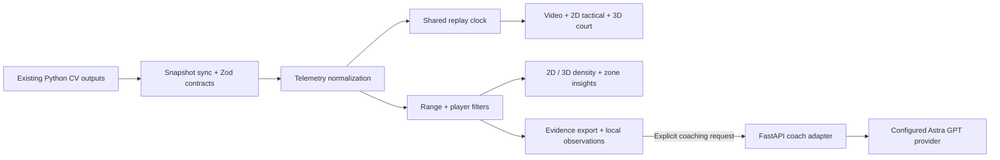

# Astra Tennis: implementation and operations

Visual preference update: the site uses the original white/off-white interface palette again, through `frontend/src/styles/astra-light.css`. Court and heatmap imagery keep their dark analytical surfaces. This color-only override preserves layout, replay, 3D features, and coaching behavior.

## Run the workspace

Requirements: Node 22+, pnpm 11, and a WebGL2 browser for 3D. The 2D tactical view and heatmap remain available without WebGL. GPU inference is not needed to replay saved analyses.

From the repository root:

```powershell
cd frontend
pnpm install
pnpm dev
```

Vite prints the loopback URL. `/` opens Match Center; `/court` opens the spatial workspace; `/agent` opens coaching with position evidence. `/overview` retains the earlier overview. Existing event, player, line-call, reporting, and system routes remain accessible. Select **Phase 5 Scoring** for the 214-frame, 30 FPS spatial example. The six earlier run snapshots do not include frame-level player trajectories, so their spatial replay shows an explicit empty state.

`pnpm data:sync` rebuilds the validated snapshot and copies demo media from local pipeline outputs when available. It requires the original output artifacts; it does not run inference. Source video is optional for court replay. `pnpm build` creates `frontend/dist`; `pnpm preview` serves it locally.

## Configure Astra GPT

The provider is intentionally unset, following the requested configurable connection. Local observations work immediately and never make a provider call. **Generate coaching** sends the selected interval's compact telemetry evidence to the local service. The video, source file paths, raw run configuration, and credentials are not included in the browser payload.

The adapter expects an OpenAI-compatible chat-completions API: `model` and `messages` in, `choices[0].message.content` out. This describes the wire format; it does not select a provider. Use the complete endpoint URL, including its chat-completions path.

In a separate terminal at the repository root, using the project's Python environment:

```powershell
Copy-Item -LiteralPath configs/astra-coach.env.example -Destination .env
# Edit .env locally: ASTRA_GPT_ENDPOINT, ASTRA_GPT_MODEL, ASTRA_GPT_API_KEY.
python -m uvicorn src.api.coach:app --host 127.0.0.1 --port 8000 --env-file .env
```

The repository's `requirements.txt` already includes FastAPI, httpx, Pydantic, uvicorn, and python-dotenv. `.env` is ignored by Git. Do not use a `VITE_` variable for credentials. Remote endpoints require HTTPS and a server API key; loopback HTTP providers can omit the key. Provider variables may also be supplied directly by the server process environment.

Vite dev and preview proxy `/api` to port 8000. `GET /api/coach/status` reports whether configuration is present (it does not probe provider availability), and `/api/docs` documents the endpoint. Missing configuration returns 503; provider rate limits return 429; connection/response failures return 502; timeouts return 504. Provider errors are sanitized, response sizes are bounded, redirects are disabled, and requests cancel when the selected evidence is removed.

For hosting beyond loopback, put static files and `/api` behind one origin, add authentication and request quotas, keep secrets on the server, and review the chosen provider's data handling. The included service is a local adapter, not a public multi-tenant deployment. A real provider call remains unverified until an endpoint/model are configured.

## Components and data flow



| Module | Responsibility |
| --- | --- |
| `frontend/src/lib/tennisTelemetry.ts` | Regulation geometry, meter-to-world coordinates, sparse frame normalization, gap-aware interpolation, speed, density, occupancy, compact coach evidence |
| `frontend/src/hooks/useReplay.ts` | Source-FPS playhead, bounded seeks, rates, stepping, loop, end-of-clip behavior, background-tab handling |
| `frontend/src/components/spatial/TelemetryDashboard.tsx` | Four accessible views, shared transport, analysis range, metrics, event inspector, JSON evidence export |
| `TennisCourt3D.tsx` in that directory | Regulation court and net, articulated avatars, ball, trails, bounce pulses, four camera presets, OrbitControls, instanced density, WebGL fallback |
| `TacticalCourt.tsx` | Readable SVG court, trajectories, current positions, keyboard-accessible event markers |
| `SpatialHeatmapPanel.tsx` | Gaussian density, combined/P1/P2 filters, shared intensity scale, range samples, selectable zones, 2D/3D switch |
| `MatchReplayTimeline.tsx` | Frame slider, replay controls, event rail, speed selection |
| `CoachPanel.tsx` | Labeled local observations, suggested/custom questions, pending/error/generated states, cancellation |
| `frontend/src/components/VideoEvidencePlayer.tsx` | Existing source video and overlays, now optionally driven by the shared transport |
| `src/api/coach.py` | Validated request contract, server configuration, evidence-grounded prompt, bounded provider connection |
| `frontend/src/styles/astra.css` | Dark visual system, player colors, typography, responsive layouts, focus and reduced-motion states |

The implementation retains YOLO11, ByteTrack, ball tracking, homography, event classification, line calls, and scoring. No training, predictions, or model accuracy claims were changed. [Repository analysis and design rationale](plans/ASTRA_3D_UPGRADE.md) records the refactoring plan and source references.

## Geometry, motion, and interpretation

- Court dimensions: 10.97 × 23.77 m doubles, 8.23 m singles, service lines 6.40 m from the net; net height 0.914 m center and 1.067 m at posts. The rendered run-off retains tracked positions behind baselines.
- World mapping: `(court x − 5.485, height, court y − 11.885)`. Height defaults to the court plane. Avatars and the ball are enlarged/stylized for readability; their anatomy and ball radius are not measurements.
- Adjacent observations interpolate continuously. Missing observations stay absent; discontinuities break movement paths. A null current position does not produce a made-up avatar location.
- Player translation and gait follow the replay clock. No serve, forehand, or backhand pose is inferred. Motion trails and bounce pulses follow persisted evidence.
- **Illustrative arc** adds event-to-event ball lift for spatial storytelling and is labeled as unmeasured. Ground paths and displayed ball speed retain court-plane semantics. Ball direction is visible in recent motion paths.
- One transport drives video, 2D, and 3D. Video corrects drift above 120 ms while playing and seeks to the selected frame when paused; codec seeking and decoding can introduce latency. Switching tabs preserves the video element and replay state. Range controls filter density, coaching, and export; they do not trim playback.
- Heatmap intensity uses a Gaussian kernel on a fixed grid and the same peak scale for both players. Combined mode overlays both players; 3D column height uses the larger local intensity and color identifies the dominant player. Height is density, not physical player height.
- Occupancy percentages count valid player-frame samples. Back court includes the run-off behind baselines; front court lies between service lines; center is the middle third of singles width; left is canonical camera orientation. These categories overlap. Left does not establish handedness, and occupancy does not establish tactical success.
- The demo covers about seven seconds. Local and generated commentary distinguish observations from hypotheses and avoid unsupported winners, scores, spin, recovered ball height, and causes of lost points. Reprojection residual is calibration fit, not independently measured officiating accuracy.

## Performance and accessibility

The Three.js scene is lazy-loaded, uses capped pixel density (1–1.6), instanced density columns, bounded trail buffers, and a demand-driven render loop. Paused scenes stop scheduling frames once camera damping settles. Playback and camera interaction invalidate frames as needed. Orbit controls and GPU resources are disposed on unmount. There is no frame-rate benchmark claim.

Tabs support arrow keys/Home/End. Camera angle, zoom, reset, event seeking, frame stepping, filters, and range controls have labeled buttons or native controls. Reduced-motion preferences suppress decorative transitions and gait. Phone layouts stack the court, player statistics, and coach; density and zone details use page scrolling. Automated axe checks supplement browser review; they do not replace a full assistive-technology audit.

## Verification

Run:

```powershell
cd frontend
pnpm check
```

```powershell
# From repository root
python -m pytest tests/test_astra_coach.py tests/test_court_geometry.py -q -p no:cacheprovider
```

The frontend checks cover lint, TypeScript, unit/component tests, and a production build. Tests cover metric mapping, gaps, density samples, replay synchronization and run changes, provider evidence isolation, failure and cancellation behavior, and accessible controls. Python coach tests use `httpx.MockTransport`; they do not contact a paid provider. Browser review covers court rendering/camera presets, replay/video event alignment, player filters, 3D density, mobile run selection, missing trajectories, and the unconfigured coach response.

Verified on 6 September 2026: **60 frontend tests across 13 files passed**, lint and TypeScript passed, and the production build succeeded. **13 Python coach/court-geometry tests passed**. Desktop (1440px), tablet (768px), and phone (390px) views were inspected in the app browser. Phone and desktop had no horizontal document overflow; the tablet navigation drawer was opened and used to visit the coach route. The phone heatmap expands with its zone details instead of clipping them inside the replay stage. The lazy 3D chunk is approximately 243 kB gzip, and the existing main application chunk is approximately 200 kB gzip.

The broader unchanged homography suite could not collect in the current MSYS Python 3.12 interpreter because `cv2` is absent. No inference or model-quality evaluation was rerun. The production build retains a size warning for the lazy Three.js scene and existing application bundle; it succeeds. Legacy scouting/tournament illustrative content is a separate data-product follow-up, as identified in the architecture plan.

## Delivery audit against the upgrade brief

| Requested outcome | Implemented evidence and verification |
| --- | --- |
| Repository analysis, architecture, and redesign plans | `docs/plans/ASTRA_3D_UPGRADE.md` inventories the existing pipeline, schemas, coordinate flow, frontend shortcomings, component architecture, design direction, motion, heatmap, coach plans, and further refactoring. The historical audit now links to this current analysis. |
| Upgraded telemetry workspace | `TelemetryDashboard` combines video, enhanced 2D, 3D, density, replay, metrics, events, and coaching. Browser tab switching and component tests verify shared state. |
| Regulation 3D court | `CourtSurface` uses shared metric constants for lines, singles/service boundaries, net, posts, and run-off. Rendered scene inspected; geometry mapping and backend court-geometry tests pass. |
| Camera movement and replay angles | Tactical, broadcast, top, cinematic, orbit, zoom, and reset implemented in `CameraRig`; browser camera buttons and drag-to-orbit visibly changed the scene. |
| Moving 3D players | Two articulated, color-coded figures with P1/P2 labels, displacement-driven locomotion, position interpolation, shadows, speed metrics, and gap-aware trails. Browser playback visibly moved both figures and updated speeds. Stroke-specific poses are optional in the brief and remain unclaimed without pose evidence. |
| Dynamic ball | Ball follows frame-indexed telemetry; recent path, tracked speed, projection marker, event bounce pulses, and optional illustrative height are implemented. Replay reached its final frame and hid the ball when the source sample was missing. |
| Improved spatial heatmaps | Shared-scale Gaussian density with run-off, combined/P1/P2 selection, frame range, 2D/3D modes, zone percentages, baseline/center/side interpretation, and click insights. Tests verify sample filtering and invalid calibration. Browser 3D density renders player-colored columns. |
| Replay and interactions | Play/pause, frame stepping, speeds, loop, slider seeking, event rail, interval filters, and evidence export share source-FPS time. Component tests verify video seeking and run reset; browser event selection aligned the paused video at frame 81 / 2.70 s. |
| Astra GPT coach | Configurable server endpoint/model/key and evidence-only request contract; local observations always available. Mocked provider tests prove successful response handling, credential isolation, validation, and sanitized failures. Live local status confirms `configured: false`, as requested; a real provider response is not claimed. |
| Premium UI and motion | Dark Manrope/Geist Mono system, lime and blue player identity, cinematic court lighting, compact telemetry, responsive panels, animated density/view transitions, and reduced-motion support. Desktop/tablet/phone were visually inspected. |
| Modular real implementation | Components, hooks, normalization, FastAPI adapter, tests, configuration example, build output, setup guide, implementation analysis, and refactoring recommendations exist as repository files. |
| Preserve the existing intelligence | Python inference/training modules are unchanged by the upgrade. The new layer consumes existing persisted outputs and never fabricates measured height, body pose, rally outcomes, or accuracy. |

The optional WebSocket/live-inference path is unnecessary for persisted recorded-video replay. Optional spin, recovered strokes, and true 3D ball reconstruction require additional validated pipeline outputs and are not presented as measured features.
