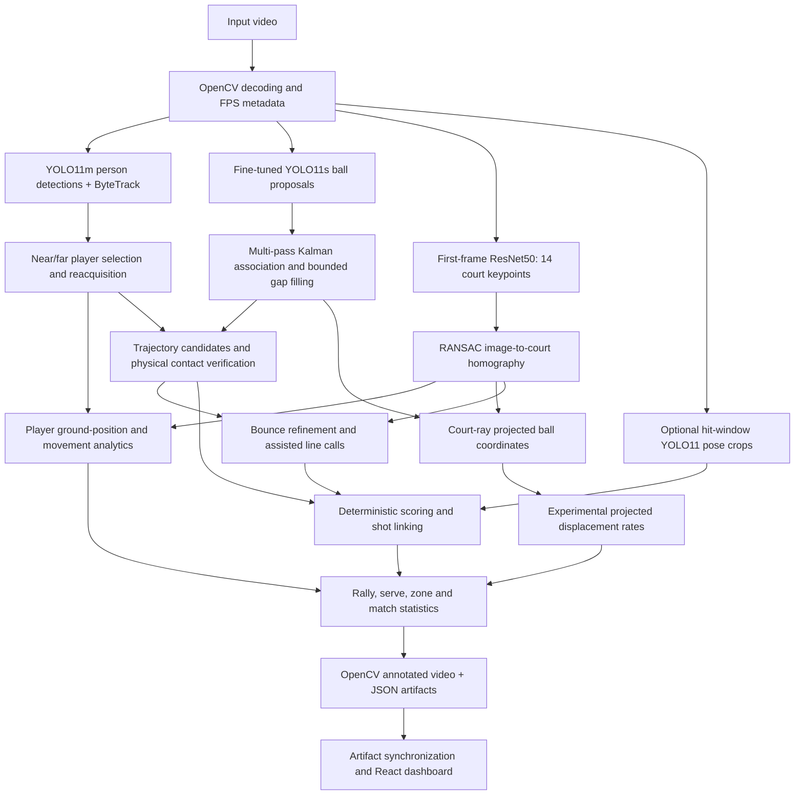

# Vision system architecture audit

Date: 2026-09-07. Baseline working commit: `cee65bb` on the user's existing, dirty working tree. The audit preserves those changes. Upgrade branch: `codex/vision-system-upgrade`.

The architecture was explained in the task before implementation changes. This document describes the inspected code, not the intended capabilities implied by names such as “production” or “high accuracy.”

## Repository snapshots

- Main GitHub source cloned to `artifacts/research/tennis-ai-agent-source`, commit `644808f2130ece14dabd2a502db5ff4bc78eeea6`. This clean clone differs from the current local checkout; it is not substituted for the user's work.
- Reference cloned to `artifacts/research/Tennis_Vision`, commit `0949a3159c9bac665453efbb16839c096c3742e5`.
- An interrupted partial clone remains at `artifacts/research/tennis-ai-agent`; use the complete `-source` clone for inspection.

## Current executable chain

### Input and preprocessing

`src/utils/video_io.py` extracts codec, dimensions, frame count and FPS through OpenCV. `read_video` materializes every decoded BGR frame in RAM. Invalid FPS silently becomes 30; the pipelines synthesize timestamps as frame index / FPS rather than reading presentation timestamps. This is a constant-frame-rate assumption, not verified variable-frame-rate support. Full matches cannot be assumed to fit RAM: one uncompressed 1080p BGR frame is approximately 6.2 MB.

### Detection models

`src/detection/player_detector.py` loads an Ultralytics model, restricts class to person, and explicitly uses ByteTrack. The Phase 6 configuration selects `yolo11m.pt`. Configured player confidence is not forwarded by the orchestrator.

`src/detection/yolo11_ball_detector.py` loads the dedicated `artifacts/models/ball/yolo11s_tennis_ball_best.pt`, extracts boxes and centers above a low confidence threshold, and exposes a highest-confidence single-frame method. Phase 6 requests 1024-pixel inference, 0.01 candidate confidence and 0.08 anchor confidence. Image preprocessing/NMS are delegated to Ultralytics. There is no optical-flow or temporal neural ball detector in the current production chain.

### Player tracking and pose

`src/tracking/player_tracker.py` ranks persistent IDs by court-keypoint proximity, assigns near/far identities by average image y, and reacquires from spatially nearby candidates. The fallback does not enforce mutual exclusion between both players or a bounded reacquisition lifetime. Court-polygon filtering exists as a separate helper but is not applied in Phase 6.

`src/shot_analysis/pose_feature_extractor.py` crops around selected hit frames, runs YOLO11n-Pose, and summarizes wrists/shoulders relative to body width. It abstains without independently specified handedness and orientation. It does not persist continuous full-body trajectories, acceleration, foot placement, preparation or recovery motion. There is no `player_motion_tracking` module yet.

There is no dedicated racket detector/tracker. A player-relative “racket region” in event rules is a proximity heuristic, not a measured racket location. Actual racket orientation/contact requires an independently evaluated visual observation.

### Ball association and postprocessing

`TemporalBallPoint` carries frame/time, image/court coordinates, confidence, source, velocity and state. `TemporalBallTracker` uses a six-state image-space constant-acceleration Kalman filter, high-confidence seeding, adaptive spatial association, short-gap reacquisition, a backward observation pass, frame-bound/outlier rejection, and interpolation. Current configuration allows four predicted frames and three interpolated frames.

`src/tracking/tracker_factory.py` resolves explicit Phase 6 settings. Older pipelines instantiate the tracker directly, leaving behavior dependent on changing class defaults. Several older callers omit source dimensions, causing the tracker to assume 1280×720. The camera-compensation flag is stored but does not perform camera estimation. High-confidence anchors bypass the same outlier rules applied to predicted/tracked points. `BallProposalFilter` exists separately and is not wired into Phase 6 inference.

Observed coverage, predicted coverage, and precision/recall are separate measurements. An uninterrupted path can follow the wrong object.

### Court and physical measurements

`CourtKeypointDetector` is torchvision ResNet-50 with 28 regression outputs. It resizes RGB to 224×224, applies ImageNet normalization, and rescales predicted coordinates into original pixels. It requests pretrained backbone weights even when a complete checkpoint is supplied. It predicts only the first frame in current pipelines, without keypoint visibility or camera-cut handling.

`TennisCourtGeometry` defines a 10.97×23.77 m doubles court, 8.23 m singles width and 14 indexed intersections. `compute_homography` fits image→court with RANSAC. Its residual and its RANSAC threshold are in destination units: **meters**, although pipeline exports/logs call them pixels. Validation thresholds of 10–15 therefore do not mean 10–15 px. Missing/singular transforms can fall back to untransformed coordinates or zeros in geometry helpers.

Player ground positions use bbox bottom-center. Player speed uses a centered displacement window; distance accumulation can bridge missing observations. Ball speed uses differences of court-projected image positions with event segmentation and smoothing. For airborne balls those positions are intersections of camera rays with the court plane, not measured 3D positions. Their derivative is not true serve/shot speed. Observation-ratio confidence tiers do not establish speed accuracy.

### Events, line calls and analytics

`TennisEventDetector` separates untyped candidates, physical player/court contact, semantic type, player attribution and final temporal suppression. It uses normalized image kinematics, player proximity, provenance and optional activity rules. Actual camera offsets/pose support must be supplied; enabling a flag alone does not produce this evidence.

`BounceContactRefiner` and `TennisLineCallEngine` refine an impact and apply court boundary/contact-patch uncertainty rules. Scoring lives in `src/scoring`, separate from CV, with event history and manual correction. `TennisShotLinker` pairs hits with later bounces, and classifiers produce stroke/direction/zone results with UNKNOWN options. Rally, serve and match modules aggregate these observations. They inherit upstream errors; current evidence does not qualify automatic winner/error interpretation.

### Visualization and storage

Phase 6 performs a second decode for rendering and writes annotated MP4 and JSON files for trajectories, detections, geometry, events, verification traces, scoring, shots/rallies and metrics. Baseline rendering uses fixed-size banners, displays final score and all bounce markers throughout the clip, and joins trails across missing observations. It does not render a measured racket or continuous pose. The mini-court duplicates court constants.

The React/Vite frontend consumes synchronized artifacts from `frontend/scripts/sync-demo-artifacts.mjs`, whose default dataset is an older Phase 5 run. A dashboard demo is not evidence that the current Phase 6 inference works. Match results are primarily JSON/files; the report's relational persistence/migration architecture is not present in this chain. The coach API is separate from the detector pipeline.

## Training and evaluation

`scripts/train/train_ball_detector.py` and `train_ball_yolo11.py` fine-tune Ultralytics models; the latter immediately evaluates test data after training. Source-group isolation, blur augmentation, dataset validation and full run provenance are not enforced there. `train_court_model.py` reads image/JSON splits, regresses 224-space keypoints with MSE/Adam, and selects the lowest validation loss. It lacks visibility-aware loss and grouped-split verification.

`scripts/evaluate/evaluate_ball.py` calls Ultralytics validation. Historical experiment scripts mix interpolation coverage with detector results, compare localization over different subsets, and hard-code VRAM values. The 214-frame benchmark contains detector-candidate boxes and confidence-derived categories, so independence of its apparent ground truth is not established.

The newer event evaluator has explicit per-video timestamp matching, maximum-cardinality/minimum-cost one-to-one assignment, annotation coverage and stage lineage. The legacy `cross_match_final_holdout` directory is now explicitly diagnostic because it was inspected and reused for development. No untouched broad-domain test is established by these artifacts. Available tests exercise deterministic logic and artifact integrity; 352 passed before changes, while real-video Phase 6 inference failed at its undefined frame-size variables.

## Reference comparison

The reference notebook uses CourtSide ball detection, YOLO11n person segmentation, contrast/Hough court lines with projective constraints and per-frame refitting, cached proposals, constant-velocity Kalman/Hungarian association and RTS smoothing. It adds a three-grayscale-frame U-Net-like BallNet trained on its own smoothed labels, audio/visual contact hypotheses, constrained 3D assumptions and zone flashes. See the accompanying research report for exact cells and sources.

It supplies ideas worth benchmarking, not a validated replacement. It uses MPS/CPU selection, one player per court side, strong baseline-camera assumptions, pseudo-label validation from the same clip, assumed contact heights, and no detected racket. Its 91% sample coverage includes filled points. The notebook has no independent component evaluation suite; advertised sample numbers cannot be used as our baseline or before/after metrics.
