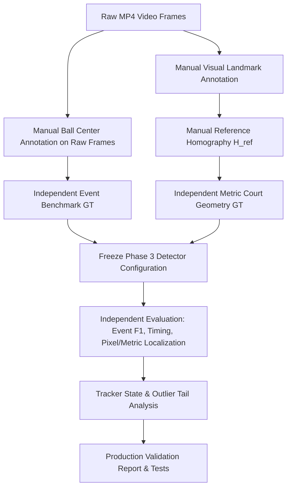

# Phase 3.1: Independent Event Validation & Court Localization Plan

## 1. Goal & Objectives
The primary objective of Phase 3.1 is to establish a rigorous, strictly independent evaluation methodology for tennis match event detection, bounce localization, and court geometry estimation.

---

## 2. Key Action Items

### 2.1 Independent Ground Truth Construction (`data/benchmarks/tennis_events_independent/`)
- Annotate all rally events directly from raw video frames without reference to any model outputs.
- Record `event_type`, `frame_min`, `frame_best`, `frame_max`, `timestamp_s`, `annotation_confidence`, and manual pixel coordinates `(x_px, y_px)` at contact frames.
- Mark provenance as `MANUAL_FROM_RAW_VIDEO`.

### 2.2 Critical Frame 188 & Event Timeline Investigation
- Document the discrepancy between the 573.4 px outlier in the baseline comparison and the true raw video physics.
- Clarify the true ground contact frame for each rally bounce:
  - Bounce 1: Frame 81 $(716.6, 734.7)$ in near service/baseline area.
  - Bounce 2: Frame 138 $(787.6, 249.4)$ in deep far court.
  - Bounce 3: Frame 178 $(1261.0, 726.0)$ near right baseline.

### 2.3 Court Coordinate Sanity & Homography Index Correction
- Audit canonical landmark keypoints (0--13) in `TennisCourtGeometry`.
- Align canonical coordinates with detector landmark order to resolve the negative $Y$ projection artifacts.
- Build a manual reference homography $\mathbf{H}_{ref}$ from annotated visible court corners.

### 2.4 Independent Metric Evaluation
- Calculate event detection Precision, Recall, F1 at $\pm 1, \pm 2, \pm 3$ frames.
- Calculate timing errors (mean frames, median frames, mean ms).
- Calculate bounce localization errors in pixels and metric centimeters (Mean, Median, P90, P95, Max).
- Calculate localization accuracy broken down by tracker state (`DETECTED`, `TRACKED`, `PREDICTED`, `INTERPOLATED`).

### 2.5 Automated Validation Integrity Tests
- Add unit tests verifying that benchmark datasets do not load model trajectories.
- Verify coordinate bounds and non-negativity of valid in-court projections.
