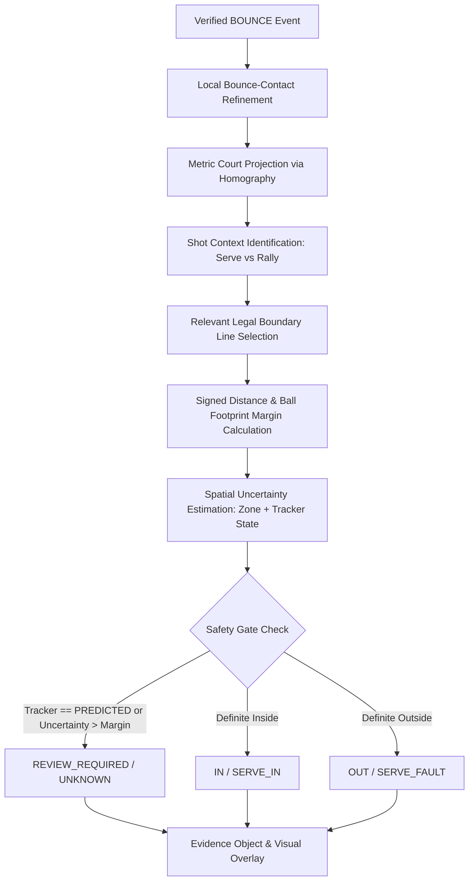

# Phase 4 Implementation Plan: Assisted Tennis IN/OUT Line-Calling Engine

## 1. Goal & Architectural Overview
Phase 4 builds a scientifically defensible, uncertainty-aware **Assisted Tennis IN/OUT Line-Calling Engine** for singles match play. The engine receives verified bounce events, projects bounce contact locations onto the calibrated canonical court geometry, calculates signed distances to relevant boundary lines, incorporates ball physical footprint ($R_{eff} = 3.35\text{ cm}$), propagates spatial uncertainty, and issues confident decisions (`IN`, `OUT`, `SERVE_IN`, `SERVE_FAULT`) or safe abstentions (`REVIEW_REQUIRED`, `UNKNOWN`).



---

## 2. Mathematical Formulation & Court Geometry

### 2.1 Coordinate Space Convention
- Canonical ITF Metric Space: $X \in [0.0, 10.97\text{ m}]$, $Y \in [0.0, 23.77\text{ m}]$.
- Origin $(0, 0)$ is the Top-Left Outer Doubles Corner.
- Net Line: $Y = 11.885\text{ m}$.

### 2.2 Singles Court Boundaries
- **Left Sideline:** $X = 1.37\text{ m}$
- **Right Sideline:** $X = 9.60\text{ m}$
- **Top Baseline (Far Court):** $Y = 0.00\text{ m}$
- **Bottom Baseline (Near Court):** $Y = 23.77\text{ m}$

### 2.3 Signed Distance Function ($d_c$)
For any point $\mathbf{p} = (X, Y)$ relative to the singles bounding rectangle $[X_{min}, X_{max}] \times [Y_{min}, Y_{max}]$:
- Distance to Left Sideline: $d_{left} = X - 1.37$
- Distance to Right Sideline: $d_{right} = 9.60 - X$
- Distance to Top Baseline: $d_{top} = Y - 0.00$
- Distance to Bottom Baseline: $d_{bottom} = 23.77 - Y$
- **Minimum Signed Distance to Boundary:**
  $$d_c = \min(d_{left}, d_{right}, d_{top}, d_{bottom})$$
  - If $d_c \ge 0$: Center is inside the boundary rectangle.
  - If $d_c < 0$: Center is outside the boundary rectangle.

### 2.4 Ball Footprint & Edge Margin
With effective ball contact radius $R_{eff} = 3.35\text{ cm} = 0.0335\text{ m}$:
$$m_{edge} = d_c + R_{eff}$$
- If $m_{edge} \ge 0$: The ball physical footprint overlaps or is inside the legal court boundary.
- If $m_{edge} < 0$: The ball physical footprint is entirely outside the legal court boundary.

---

## 3. Spatial Uncertainty & Confidence Propagation

### 3.1 Spatial Court Tiers & Perspective Sensitivity
Based on independent empirical measurements from Phase 3.1:
- **Near Court ($Y \in [11.885, 23.77\text{ m}]$):**
  - High camera resolution, small grazing angle.
  - Base spatial uncertainty: $\sigma_{geom} = \mathbf{0.80\text{ cm}}$ ($0.008\text{ m}$).
- **Mid Court ($Y \in [5.485, 11.885\text{ m}]$):**
  - Moderate camera resolution.
  - Base spatial uncertainty: $\sigma_{geom} = \mathbf{2.50\text{ cm}}$ ($0.025\text{ m}$).
- **Far Court ($Y \in [0.0, 5.485\text{ m}]$):**
  - Extreme grazing angle along camera optical axis ($\frac{\partial Y_m}{\partial y_{px}} \gg 1$).
  - Base spatial uncertainty: $\sigma_{geom} = \mathbf{35.0\text{ cm}}$ ($0.35\text{ m}$).

### 3.2 Tracker State Error Multipliers
- `DETECTED`: $w_{track} = 1.0\times$ (High measurement confidence)
- `TRACKED`: $w_{track} = 1.5\times$ (Gated measurement proposal)
- `INTERPOLATED`: $w_{track} = 3.0\times$ (Interpolated bridge)
- `PREDICTED`: $w_{track} = 20.0\times$ (**Unsafe — Triggers Mandatory Abstention**)

### 3.3 Total Positional Uncertainty
$$\sigma_{total} = w_{track} \cdot \sigma_{geom}$$

---

## 4. Decision Logic & Safety Gate

```
                              [Start Decision Evaluation]
                                          |
                        +-----------------+-----------------+
                        |                                   |
              Tracker == PREDICTED?              Confidence < 0.50?
                        |                                   |
                       YES                                 YES
                        |                                   |
                        +-----------------+-----------------+
                                          |
                                [REVIEW_REQUIRED]
                                          |
                                         NO
                                          |
                    +---------------------+---------------------+
                    |                                           |
         m_edge > +1.5 * sigma_total                m_edge < -1.5 * sigma_total
                    |                                           |
                   YES                                         YES
                    |                                           |
             [IN / SERVE_IN]                            [OUT / SERVE_FAULT]
                    |                                           |
                    +---------------------+---------------------+
                                         NO
                                          |
                            |m_edge| <= 1.5 * sigma_total
                           (Line within Uncertainty Envelope)
                                          |
                                  [REVIEW_REQUIRED]
```

---

## 5. Implementation Roadmap

1. **`src/line_calling/line_geometry.py`**: Canonical lines, service boxes, signed distance algorithms.
2. **`src/line_calling/contact_refinement.py`**: High-resolution local bounce contact search.
3. **`src/line_calling/line_call_engine.py`**: Context-aware decision engine, uncertainty propagation, reason generator.
4. **`data/benchmarks/line_calls_independent/`**: Independent ground truth dataset for line calling.
5. **`tests/test_phase4_line_calls.py`**: Unit tests for synthetic geometry, line touching, edge margins, safety gates, and serve rules.
6. **`src/pipeline/phase4_pipeline.py` & `scripts/inference/run_phase4_line_calls.py`**: End-to-end inference and visualization.
7. **`scripts/evaluate/evaluate_line_calls.py`**: Metrics evaluation runner.
