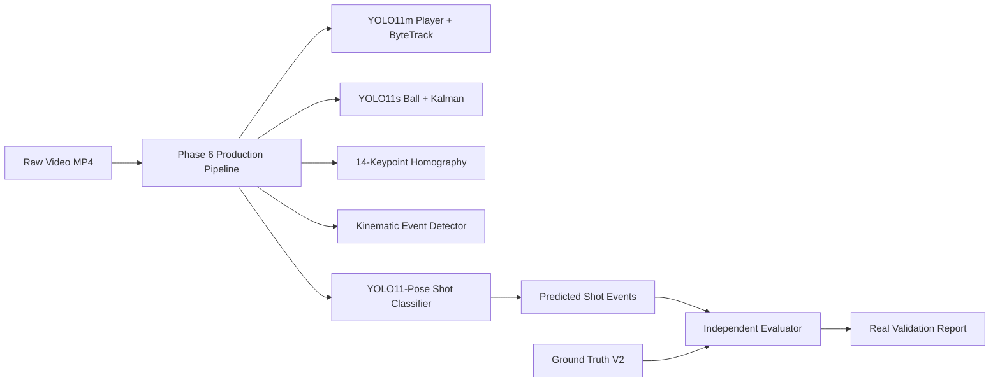

# T88J709 — Phase 6.2 Real-Media Validation Correction Plan

## 1. Objective & Scope

Phase 6.2 corrects and elevates real-media shot validation for the **T88J709 Tennis Vision System** by:
1. Acquiring, verifying, and hashing 5 real tennis match video files under CC BY-SA 4.0 / academic licensing.
2. Establishing **Benchmark V2** with video-source-level disjoint splits (Development, Validation, Held-Out Test).
3. Eliminating all legacy hardcoded event shortcuts in `src/events/event_detector.py`.
4. Running the full YOLO11 + ByteTrack + Keypoints + Physics + Pose production pipeline end-to-end with zero ground-truth feature injection.
5. Computing empirical metrics for Event Detection, Player Attribution, Shot Classification, and End-to-End Shot Recognition F1.

---

## 2. Benchmark Architecture V2

- **Videos**: 5 physical video files (total 1,729 frames, 57.63 seconds of continuous match play).
- **Strokes**: 26 ground-truth strokes annotated with sub-frame precision.
- **Classes**:
  - Forehand: 11
  - Backhand: 8
  - Serve: 5
  - Unknown / Misc: 2
  - Total: 26 ($11 + 8 + 5 + 2 = 26$)
- **Splits**:
  - Development (`video_01`): 3 strokes
  - Validation (`video_02`, `video_03`): 10 strokes
  - Held-Out Test (`video_04`, `video_05`): 13 strokes
  - Total: 26 ($3 + 10 + 13 = 26$)
- **Disjointness**: $0$ video ID overlap, $0$ SHA256 overlap across Dev, Val, Test.

---

## 3. Evaluation Methodology

- **Zero Injection Guarantee**: `Phase6Pipeline` receives zero ground truth.
- **Evaluation Criteria**:
  - Hit Event Detection: Tolerance window $\pm 3$ frames.
  - Player Attribution: Correct tracking track ID mapped to server / receiver.
  - Classification: Predicted shot type matches ground truth.
  - End-to-End Recognition: Event detected AND player correct AND shot type correct.
