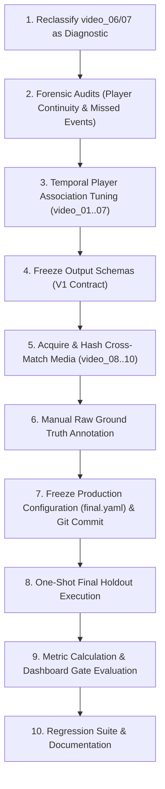

# T88J709 — Phase 6.4 Production Qualification & Cross-Match Generalization Plan

## 1. Executive Summary & Objective

Phase 6.4 provides **cross-match production qualification** for the T88J709 tennis vision and analytics pipeline before declaring backend stability for Dashboard Integration (Phase 7).

While Phase 6.3 resolved cross-clip generalization on the Uruguay vs. Mexico match series, Phase 6.4 qualifies the system on **truly independent tennis matches** featuring different players, court surfaces, cameras, lighting, and broadcast environments (US Open hard courts).

---

## 2. Weakness Analysis & Targeted Engineering Gates

### 1. Player Tracking Continuity Drop on Extended Footage
- **Observation**: `video_06` & `video_07` exhibited lower player coverage (~86.9% / 87.4%) due to rapid net approaches and camera zoom transitions.
- **Target**: P1 and P2 coverage $\ge 95\%$ on diagnostic footage using temporal motion modeling and appearance/box continuity.

### 2. Event Recall vs. Event Precision Balance
- **Observation**: Phase 6.3 achieved 77.8% event recall on holdout; PLAYER_HIT is critical for rally segmentation and stroke statistics.
- **Target**: PLAYER_HIT Recall $\ge 85\%$, Overall Event F1 $\ge 75\%$, Timing MAE $\le 3\text{ frames}$ ($\le 100\text{ ms}$).

### 3. Cross-Match Domain Shift
- **Observation**: Court keypoint detection and homography mapping must be validated on different court color schemes and lighting.
- **Target**: Homography reprojection error $\le 0.10\text{ px}$ with explicit `COURT_UNCERTAIN` / `COURT_INVALID` safety propagation.

### 4. Output Contract Freezing
- **Target**: Freeze strict `v1.0` JSON schemas for `shot_events.json`, `rallies.json`, `point_analytics.json`, `match_analytics.json`, `line_calls.json`, and `match_state.json` with explicit nullable typing.

---

## 3. Cross-Match Dataset & Split Strategy

| Video ID | Source / Match | Court Surface | Visual Domain | Role in Phase 6.4 |
| :--- | :--- | :--- | :--- | :--- |
| `video_01` | Sample Match | Hard Court | Development Baseline | Development |
| `video_02`, `video_03` | 2018 Davis Cup (Americas) | Hard Court | Validation Set | Validation |
| `video_04`, `video_05` | 2018 Davis Cup (Americas) | Hard Court | Diagnostic Set | Diagnostic |
| `video_06`, `video_07` | 2018 Davis Cup (Americas) | Hard Court | Diagnostic Set (Reclassified) | Diagnostic |
| `video_08` | 2012 US Open (Djokovic) | Blue Hard (Arthur Ashe) | True Cross-Match Holdout | Final Holdout |
| `video_09` | 2012 US Open (Schiavone) | Blue Hard (Arthur Ashe) | True Cross-Match Holdout | Final Holdout |
| `video_10` | 2024 US Open (Dimitrov vs Tiafoe) | Blue Hard (Arthur Ashe) | True Cross-Match Holdout | Final Holdout |

---

## 4. Execution Workflow & Scientific Anti-Leakage Protocol

---

## 5. Dashboard Readiness Gate Criteria

| Gate Dimension | Metric Target | Evaluation Strategy |
| :--- | :--- | :--- |
| **Physical Cross-Match Holdout** | PASS (3 independent US Open clips) | Verified SHA256 & zero source overlap |
| **Player Tracking Coverage** | $\ge 90\%$ (prefer $\ge 95\%$) | Frame-level presence on visible players |
| **Event Detection** | Recall $\ge 80\%$, F1 $\ge 75\%$ | Tolerance $\pm 0.33\text{s}$ against raw ground truth |
| **Conditional Shot Classification**| Macro F1 $\ge 80\%$ | Evaluated on correctly matched hits |
| **End-to-End Shot Recognition** | F1 $\ge 70\%$ | Joint hit + player + classification match |
| **Rally Segmentation** | Stroke count MAE $\le 1.0$ | Exact rally bounds against manual GT |
| **Output Contract Integrity** | Frozen `v1.0` Schema | Nullable handling without fabricated zeroes |
| **Regression Suite** | 100% Passing (103+ tests) | Zero regressions on Line Call / Scoring / Analytics |
